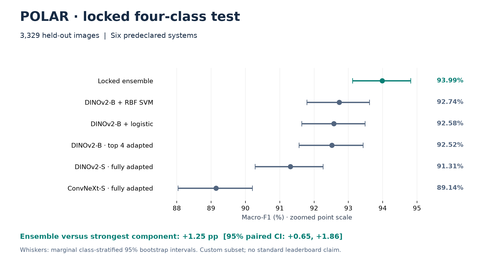
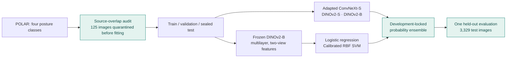

# POLAR Posture Recognition

**A source-overlap-audited benchmark with DINOv2, ConvNeXt and complementary classifiers**

[](https://github.com/abdullahuseyinli-dot/polar-posture-recognition/actions/workflows/ci.yml?query=branch%3Amain)
[](pyproject.toml)
[](LICENSE)

This project studies how pretrained visual representations, person-context views and
complementary classifiers recognize **sitting, standing, walking and running**.
Its strongest system is a development-locked ensemble of adapted DINOv2/ConvNeXt
models and linear/nonlinear classifiers on frozen DINOv2 features.

| Held-out macro-F1 | Accuracy | Evaluation |
| ---: | ---: | --- |
| **93.99%** | **94.56%** | 3,329 images · audited four-class POLAR subset · one locked test opening |

The macro-F1 95% bootstrap interval is **93.12–94.81%**. This is a custom four-class
protocol, not a claim of state of the art on the original nine-class POLAR task.

[Results](docs/RESULTS.md) · [System design](docs/ARCHITECTURE.md) ·
[Model card](docs/MODEL_CARD.md) · [Reproduce](docs/REPRODUCIBILITY.md) ·
[Full report](docs/POLAR_PUBLIC_REPORT.md) · [PDF](output/pdf/polar_public_report_v1.0.0.pdf)

## Held-out results



| Predeclared system | Macro-F1 | Accuracy |
| --- | ---: | ---: |
| **Locked five-component ensemble** | **93.99%** | **94.56%** |
| Frozen DINOv2-B multilayer + RBF SVM | 92.74% | 93.42% |
| Frozen DINOv2-B multilayer + logistic regression | 92.58% | 93.24% |
| DINOv2-B, top four blocks adapted | 92.52% | 93.27% |
| DINOv2-S, fully adapted | 91.31% | 92.10% |
| ConvNeXt-S, fully adapted | 89.14% | 89.94% |

The ensemble improves over the strongest component by **+1.25 percentage points**
(95% paired interval **+0.65 to +1.86**). Its improvement interval is positive against
each declared component. [Metrics](results/polar_test_metrics.csv) ·
[Uncertainty](results/polar_test_uncertainty.json).

## How the system works



The contribution is the audited protocol, person-centric adaptation and evidence-backed
combination—not the invention of the pretrained DINOv2 or ConvNeXt backbones.
Frozen features, adapted models and evaluation views are documented separately.

## Further results, with separate evaluation boundaries

| Experiment | Macro-F1 | What this number means |
| --- | ---: | --- |
| Three-class collapse of the POLAR ensemble | **96.11%** | Secondary task: walking and running merged; not the four-class headline |
| V-COCO scale-conditioned DINO stack | **86.63%** | Locked test: 6,077 people; custom three-class posture mapping |
| DINO + SigLIP factorized reliability stack | **86.97%** | Later nested, image-grouped V-COCO development; not a new test score |
| Matched DINOv3-B representation | **83.67%** | Same representation screen as DINOv2-B at 83.95%; not a winning replacement |

These rows are not a ranking: tasks, populations and selection procedures differ.
The [results guide](docs/RESULTS.md) includes the learning curve, per-class confusion,
transfer improvements, factorized-head controls, DINOv3/SigLIP2 comparisons and
their uncertainty. The [V-COCO report](docs/VCOCO_V2_EXTERNAL_TRANSFER.md) and
[representation guide](docs/REPRESENTATIONS.md) provide the full context.

## Inspect and reproduce

Verify result arithmetic, imported evidence hashes, figure sources, metadata and
current documentation with Python's standard library; no GPU or dataset required:

```bash
git clone https://github.com/abdullahuseyinli-dot/polar-posture-recognition.git
cd polar-posture-recognition
python tools/check_project.py
```

[Installation and synthetic tests](docs/REPRODUCIBILITY.md) ·
[Executed historical notebook](human_activity_classification.ipynb) ·
[Documentation index](docs/README.md) · [Evidence inventory](results/README.md)

Model weights, feature caches and source images are not distributed. Aggregate
verification is not checkpoint replay. Full reproduction needs the original data,
checkpoints and matching environment; the guide makes these boundaries explicit.

## Companion architecture project

[**ARFTR**](https://github.com/abdullahuseyinli-dot/arftr) develops actor-memory,
factorized correction and temporal evidence on Okutama video. It has its own
architecture, component studies and results. Its **85.38% adaptive development**
score is not comparable with this project's **93.99% held-out POLAR** score.

## Project information

Author: **Abdulla Huseyinli**. Independent project version **1.0.0**.
Original study v1/v2 identifiers remain unchanged; see [provenance](docs/PROJECT_HISTORY.md).
[Citation](CITATION.cff) · [MIT License](LICENSE) ·
[Third-party terms](THIRD_PARTY_NOTICES.md) · [Contributing](CONTRIBUTING.md) ·
[Changelog](CHANGELOG.md)
