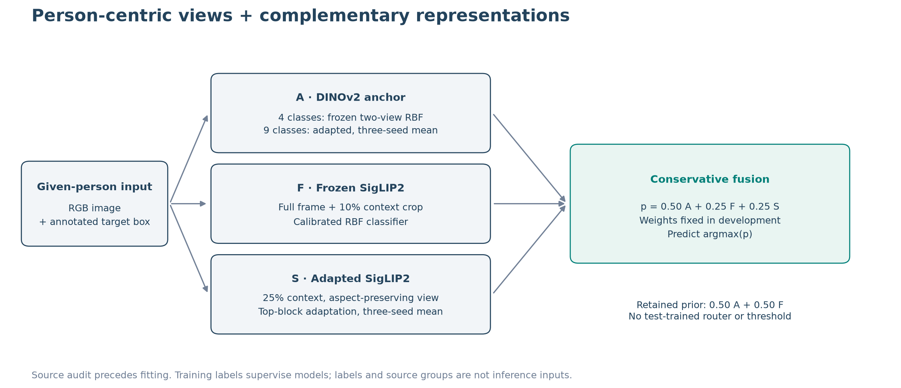
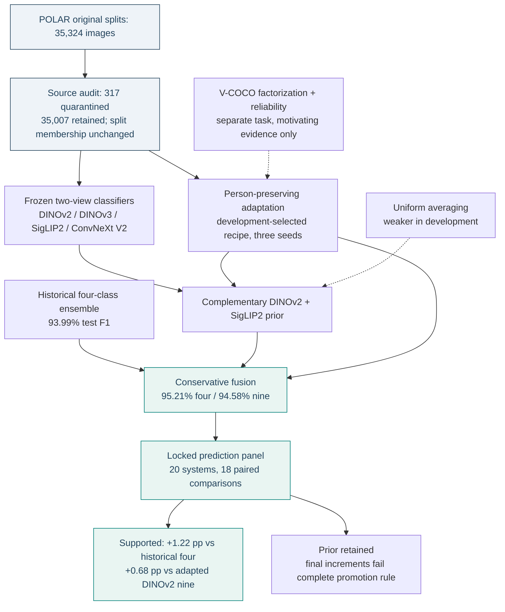

# Architecture and experimental evidence

## Current system

Given an RGB image and an annotated target-person box, the system produces a
four- or nine-class probability vector. It does not detect people, infer tracks
or consume action labels at inference.

| Branch | Four-class task | Nine-class task |
| --- | --- | --- |
| A: DINOv2 anchor | Frozen DINOv2-B two-view features; calibrated RBF | Top-four-block and normalization adaptation; mean of seeds 42/52/62 |
| F: frozen SigLIP2 | Full-frame + 10% person-context features; calibrated RBF | Same feature/head recipe, nine-class labels |
| S: adapted SigLIP2 | Top-four-block adaptation; mean of three seeds | Same adaptation family, nine-class labels |
| Retained prior | 0.50 A + 0.50 F | 0.50 A + 0.50 F |
| Conservative nominee | 0.50 A + 0.25 F + 0.25 S | 0.50 A + 0.25 F + 0.25 S |
| Replacement control | 0.50 A + 0.50 S | 0.50 A + 0.50 S |

Weights were fixed during development. The final evaluation measures the nominee
without changing weights or selecting the highest test-scoring control.

## Representations and training

Frozen encoders concatenate full-frame and 10%-context person-view embeddings.
Training-only scaling precedes an unweighted RBF SVM with C = 10 and gamma = 1/d.
Five source-grouped folds fit sigmoid calibration within the available training
population. Frozen DINOv2, DINOv3, SigLIP2 and ConvNeXt V2 share this head budget,
not identical pretraining data or compute.

Adapted encoders use a 25%-context, aspect-preserving person crop padded to 224
pixels. DINOv2 unfreezes its last four blocks and backbone normalization layers;
SigLIP2 unfreezes its last four blocks, final normalization and attention pooler;
ConvNeXt V2 unfreezes its final stage and final normalization.

The locked neural recipe uses unweighted cross-entropy, AdamW (head learning rate
0.001, backbone 0.000005, weight decay 0.0001), dropout 0.1, gradient clipping 1,
batch size 16 with accumulation 4, and CUDA bfloat16. Seeds are 42, 52 and 62.
Final refit epochs are development-selected medians: four-class SigLIP2 10,
ConvNeXt V2 15; nine-class DINOv2 16, SigLIP2 10, ConvNeXt V2 18. The learning-rate
schedule retains the original 20-epoch horizon.

[Locked protocol](research/20260921_final_evaluation/PROTOCOL.md) ·
[Representation caveats](REPRESENTATIONS.md).

## Evidence map

Solid connections show lineage or evaluated comparisons, not necessarily isolated
causal effects. Dashed connections identify lessons or hypotheses transferred
between experiments. The historical ensemble is a reference, not a fusion input.

## Supported mechanisms and unresolved causes

- Person preservation and a milder augmentation recipe improved the same
  nine-class seed by 2.50 validation points. Because both changed, the crop alone
  does not receive causal credit.
- Nine-class fusion gives 80 rescues and 33 harms relative to adapted DINOv2.
  That is direct paired evidence of useful complementary predictions.
- Frozen SigLIP2 already reaches 95.19% on four classes. Adding neural branches
  does not establish superiority there; this is a task-dependent tradeoff.
- DINOv3 and ConvNeXt V2 did not become replacement winners under this protocol.
  This is not a general verdict on the pretrained model families.
- Remaining posture-boundary confusions suggest missing visual distinctions,
  but labels, static ambiguity and background dependence were not causally isolated.

## Implementation map

| Responsibility | Maintained implementation |
| --- | --- |
| Nine-class preparation and source audit | [polar_benchmark_data.py](../src/hac/polar_benchmark_data.py) |
| Backbone feature extraction | [polar_benchmark_features.py](../src/hac/polar_benchmark_features.py) |
| Person-preserving neural training | [polar_benchmark.py](../src/hac/polar_benchmark.py) |
| Locked final neural refits | [polar_locked_neural.py](../src/hac/polar_locked_neural.py) |
| Paired inference statistics | [polar_locked_statistics.py](../src/hac/polar_locked_statistics.py) |
| Portable prediction replay | [verify_benchmark_predictions.py](../tools/verify_benchmark_predictions.py) |

The original four-class five-component ensemble is described in the preserved
[study report](POLAR_PUBLIC_REPORT.md). Its historical 92.74% multilayer DINOv2
classifier differs from the current 93.09% frozen two-view comparator.
