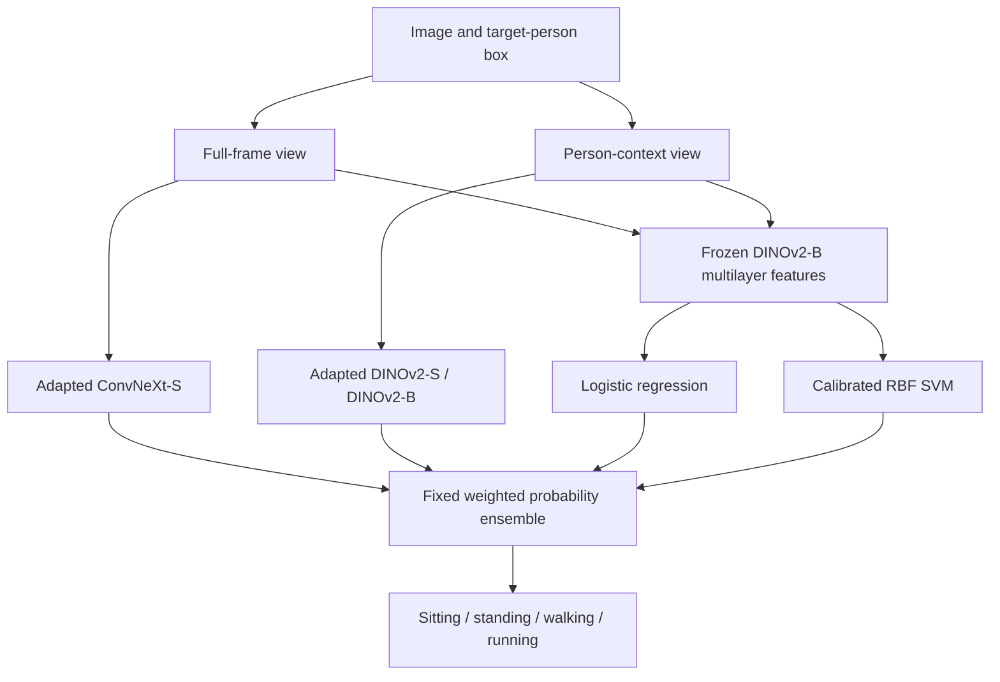

# System design

The strongest POLAR system combines pretrained encoders adapted in different ways
with classifiers on frozen representations. The research contribution is the
audited evaluation and demonstrated complementary evidence, not a new DINOv2 or
ConvNeXt backbone.

## Locked ensemble

| Component | Input/representation | Training | Weight |
| --- | --- | --- | ---: |
| ConvNeXt-S | Full frame | Full adaptation; three-seed probability mean | 0.20 |
| DINOv2-S | Person-context crop | Full adaptation; three-seed probability mean | 0.15 |
| DINOv2-B | Person-context crop | Top four blocks adapted; three-seed probability mean | 0.25 |
| Logistic regression | Frozen DINOv2-B multilayer, two views | Standardized linear classifier | 0.20 |
| Calibrated RBF SVM | Same frozen feature family | Nonlinear classifier with calibration | 0.20 |

The feature probe concatenates full-frame and person-context views. Seeds are
42, 52 and 62 for the neural fits. The development-selected weights sum to one
and are frozen before the final test evaluation.
[Selection lock](../results/polar_final_selection_lock.json),
[fit manifest](../results/polar_final_fit_manifest.json).

The system uses provided person boxes; this is not an end-to-end person detector.
Input views and adaptation scope differ across neural candidates, so their raw
score differences do not isolate backbone architecture alone.

## Person-centric V-COCO follow-up

The separately trained scale-conditioned stack uses aspect-preserving tight and
context views, frozen DINOv2 features, cross-fitted view probabilities and five
box-geometry features. Training-split candidates are selected on validation,
then the locked system is refit on train plus validation before one test opening.
The three-class mapping merges walking and running. The follow-up is not zero-shot
transfer and is not the standard V-COCO agent/role detection task.
[Full design and controls](VCOCO_V2_EXTERNAL_TRANSFER.md).

## Later representation and fusion screens

The later DINOv2/DINOv3/SigLIP2 screen compares matched views and nested grouped
classifier selection. Its DINO/SigLIP factorized reliability stack is a separate
development experiment, not a sixth component retrofitted into the locked POLAR
ensemble. [Representation guide](REPRESENTATIONS.md).

## Source map

| Responsibility | Implementation |
| --- | --- |
| Image models | [polar_models.py](../src/hac/polar_models.py) |
| Frozen multilayer features | [polar_features.py](../src/hac/polar_features.py) |
| Training | [polar_training.py](../src/hac/polar_training.py) |
| Metrics | [metrics.py](../src/hac/metrics.py) |
| Final POLAR evaluation | [evaluate_polar_final.py](../experiments/evaluate_polar_final.py) |
| V-COCO mapping and views | [vcoco.py](../src/hac/vcoco.py) |
| Pinned DINOv3/SigLIP2 encoders | [vcoco_v3_representations.py](../src/hac/vcoco_v3_representations.py) |
| Nested heads and grouping | [vcoco_v3_models.py](../src/hac/vcoco_v3_models.py) |
