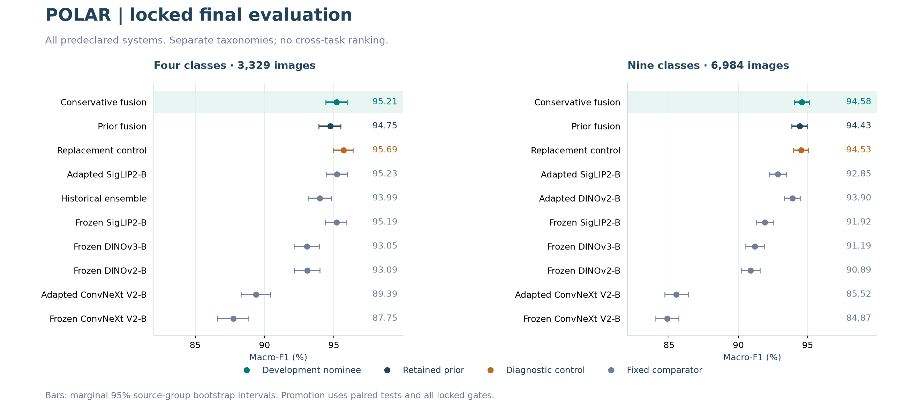
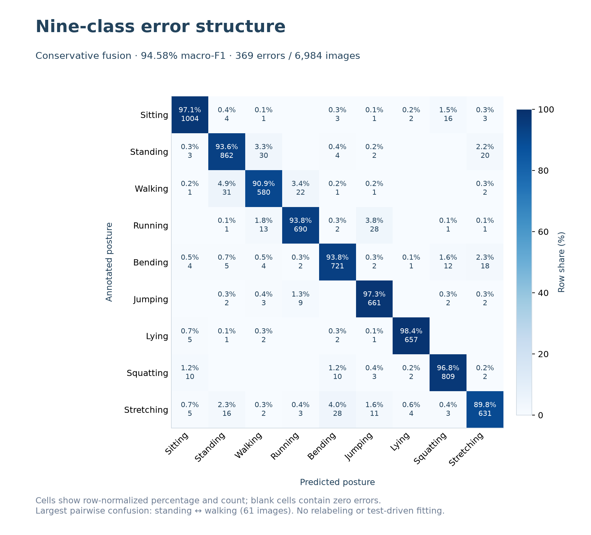

# Person-Centric Representations for Four- and Nine-Class POLAR Posture Recognition

## Abstract

This study evaluates person-centric adaptation and complementary visual
representations for still-image posture classification. A source-overlap audit
retains 35,007 of the original 35,324 POLAR images without reassigning official
split membership. Frozen DINOv2, DINOv3, SigLIP2 and ConvNeXt V2 classifiers are
compared with partially adapted models and development-fixed probability fusions.
The development-nominated conservative fusion obtains 95.211% macro-F1 on 3,329
four-class test images and 94.583% on 6,984 nine-class images. Paired gains over
the historical four-class ensemble and the nine-class adapted-DINOv2 reference
are +1.223 and +0.679 percentage points, respectively. Smaller gains against the
immediate prior models fail the complete locked promotion rule, leaving those
priors retained. Public probability arrays support replay of candidate metrics,
paired comparisons and resampling without images or model weights. The study is
an audited-cohort benchmark, not an external state-of-the-art claim; the previously
inspected four-class test forms part of the nine-class test.

## 1. Scope and contribution

The task is posture classification given an RGB image and a supplied target-person
bounding box. It is not person detection, temporal action recognition or clinical
assessment. Four classes cover sitting, standing, walking and running; the
nine-class task adds bending, jumping, lying, squatting and stretching.

The contribution is an empirical system and evaluation protocol: source-aware
data preparation, controlled frozen-feature comparisons, person-preserving
adaptation, fixed complementary fusion and traceable prediction-level evidence.
The pretrained encoders are prior work, not newly invented backbones. This report
extends the [original four-class study](https://github.com/abdullahuseyinli-dot/polar-posture-recognition/blob/main/docs/POLAR_PUBLIC_REPORT.md); its historical
five-component ensemble remains a fixed comparator.

## 2. Dataset and evaluation boundary

POLAR version 1 provides the original data and labels. See the
[dataset record](https://doi.org/10.17632/hvnsh7rwz7.1) and
[Ma and Liang's original paper](https://doi.org/10.1109/ICSAI48974.2019.9010160).
The audit inherited the original four-class quarantine and added label-blind
canonical-source and confirmed perceptual-hash checks across all nine classes.

| Population | Train | Validation | Test | Total |
| --- | ---: | ---: | ---: | ---: |
| Original nine-class release | 21,194 | 7,065 | 7,065 | 35,324 |
| Source-audited nine-class cohort | 21,057 | 6,966 | 6,984 | 35,007 |
| Source-audited four-class subset | 9,958 | 3,327 | 3,329 | 16,614 |

In total, 317 images in 154 cross-split source components were quarantined,
including 125 inherited exclusions. No image was moved to a different official
split. Final models were refitted on train plus validation after selection was
locked. The public [cohort package](https://github.com/abdullahuseyinli-dot/polar-posture-recognition/blob/main/results/polar_20260921/README.md) records
membership, labels, boxes, source groups and image/annotation hashes.

The audit is not a verified subject, scene or session split. Same-split near
duplicates are not exhaustively grouped, and the nine-class audit did not include
a new exhaustive embedding-based duplicate search. Pretraining overlap is unknown.
The historically inspected four-class test is nested in the nine-class test;
the final phase is locked but its test population is not wholly untouched.

## 3. Methods

### 3.1 Frozen two-view classifiers

Each frozen encoder provides full-frame and 10%-context person-view embeddings,
which are concatenated. A training-only scaler and unweighted RBF classifier use
C = 10 and gamma = 1/d. Sigmoid calibration uses five source-grouped training
folds. The four families share the downstream search budget and split membership,
not matched pretraining data, model capacity or total computation.

The DINOv3-B checkpoint was recovered from the transferred project and verified
by hash. Its original processor JSON was unavailable; Transformers 5.5.3 defaults
were reconstructed at 224 pixels with bilinear resizing and ImageNet normalization.
This establishes the local recipe, not provider preprocessing byte parity or the
general 256-pixel DINOv3 recipe. DINOv3-L was unavailable and is not reported.

### 3.2 Person-preserving adaptation

Adapted models use a 25%-context person view with aspect-preserving padding to
224 pixels. DINOv2 adapts its last four blocks and backbone normalization layers;
SigLIP2 its last four blocks, final normalization and attention pooler; ConvNeXt V2
its last stage and final normalization. Training uses unweighted cross-entropy,
AdamW, head/backbone learning rates 0.001/0.000005, weight decay 0.0001, dropout
0.1, gradient clipping 1 and effective batch size 64 (16 with accumulation 4).
Neural fits use CUDA bfloat16 and seeds 42, 52 and 62. No mixup or label smoothing
is used in the locked recipe.

Refit epoch counts are medians selected in development: four-class SigLIP2 10
and ConvNeXt V2 15; nine-class DINOv2 16, SigLIP2 10 and ConvNeXt V2 18. The
learning-rate schedule retains its original 20-epoch horizon. Final fits do not
select epochs using test performance.

### 3.3 Complementary probability fusion

Let A denote the DINOv2 anchor, F frozen SigLIP2 and S the mean of the three
adapted-SigLIP2 probability vectors. A is a frozen two-view classifier for four
classes and a three-seed adapted model for nine classes.

| System | Probability vector | Role |
| --- | --- | --- |
| Prior fusion | 0.50 A + 0.50 F | Retained incumbent |
| Conservative fusion | 0.50 A + 0.25 F + 0.25 S | Development nominee |
| Replacement fusion | 0.50 A + 0.50 S | Predeclared diagnostic control |

Prediction is argmax of the probability vector. Weights are development-fixed;
no router, threshold or annotation-only support category is learned from test labels.

## 4. Locked evaluation

The final phase completed 23 refits (15 neural and eight frozen heads), followed
by fixed prediction and comparison panels. Ten systems per task and 18 paired
comparisons were specified before final test extraction. The selection-lock hash is
recorded in the [public manifest](https://github.com/abdullahuseyinli-dot/polar-posture-recognition/blob/main/results/polar_20260921/manifest.json).

Primary reporting uses macro-F1, supplemented by accuracy, class-wise metrics,
NLL, summed multiclass Brier, calibration and selective-risk diagnostics. Uncertainty
uses 5,000 class-stratified row bootstrap and 5,000 source-group bootstrap draws.
Paired randomization uses 10,000 two-sided source-group swaps with the plus-one
p-value correction. Holm adjustment covers all 18 comparisons. Intervals are
not simultaneous or adjusted for adaptive historical selection.

Promotion requires positive F1 and net corrections, a positive lower source-group
delta interval, Holm p below 0.05, no class-F1 drop above one point, NLL increase
at most 0.02, Brier increase at most 0.01, and positive F1/net corrections for
every matching seed pair. The comparison family and gates remain unchanged after
inspection. Engineering recoveries concerned execution and metadata, not model
selection; the [dated record](https://github.com/abdullahuseyinli-dot/polar-posture-recognition/blob/main/docs/research/20260921_final_evaluation/RESULTS.md)
links their audit receipts.

## 5. Results

| System | Four-class F1 | Nine-class F1 |
| --- | ---: | ---: |
| Conservative nominee | 95.211% | 94.583% |
| Retained prior | 94.746% | 94.425% |
| Replacement control | 95.691% | 94.527% |
| Frozen DINOv2-B | 93.089% | 90.892% |
| Frozen DINOv3-B | 93.055% | 91.195% |
| Frozen SigLIP2-B | 95.191% | 91.916% |
| Frozen ConvNeXt V2-B | 87.749% | 84.873% |
| Adapted SigLIP2-B | 95.227% | 92.853% |
| Adapted ConvNeXt V2-B | 89.393% | 85.516% |
| Adapted DINOv2-B | — | 93.904% |
| Historical ensemble | 93.988% | — |

The nominee makes 141 errors on four classes (95.764% accuracy) and 369 on nine
(94.716% accuracy). Source-group 95% F1 intervals are 94.425–95.945% and
94.031–95.110%. The replacement control's higher four-class point estimate does
not make it a post-test-selected winner.

<!-- pagebreak -->

### 5.1 Paired comparisons and probability quality

| Nominee comparison | F1 gain (pp) | Paired 95% interval (pp) | Rescue / harm | Holm p |
| --- | ---: | --- | ---: | ---: |
| Four vs historical | +1.223 | +0.573 to +1.940 | 75 / 35 | 0.00420 |
| Four vs immediate prior | +0.465 | +0.064 to +0.890 | 27 / 13 | 0.19858 |
| Nine vs adapted DINOv2 | +0.679 | +0.381 to +0.987 | 80 / 33 | 0.00180 |
| Nine vs immediate prior | +0.158 | −0.091 to +0.408 | 44 / 33 | 0.90831 |

The first and third comparisons support within-protocol gains against their fixed
references. Neither task passes every promotion condition against its immediate
prior, despite positive seed diagnostics and passing class/probability-safety
checks. The correct decision is to retain both prior models, not change the
testing family or nominate the best test-scoring control.

The nominee's NLL/Brier/ECE are 0.1370/0.0664/0.0390 on four classes and
0.1684/0.0812/0.0228 on nine. Nine-class prior values are 0.2021/0.0908/0.0447.
Better probability scores do not override the locked macro-F1 promotion rule.
All metrics and per-class values appear in the [results guide](https://github.com/abdullahuseyinli-dot/polar-posture-recognition/blob/main/docs/RESULTS.md).

## 6. Error structure and mechanism evidence

<!-- pagebreak -->

Standing/walking contributes 61 bidirectional confusions, bending/stretching 46,
running/jumping 37, standing/stretching 36 and walking/running 35. Walking and
stretching have the lowest nominee F1 values (91.12% and 91.32%). These describe
error concentration, not proven causal mechanisms. Static ambiguity, viewpoint,
background dependence and annotation semantics remain rival explanations.

Development evidence suggests three useful mechanisms. First, two-view RBF heads
beat the best screened linear heads by 0.73–1.36 points on four classes and
0.75–2.29 on nine across the four families. Second, person preservation combined
with the milder augmentation recipe improves the same nine-class DINOv2 seed from
90.73% to 93.23% validation F1; the two changes are not causally separated. Third,
selective DINOv2/SigLIP2 fusion beats uniform all-family averaging in development.
The final nine-class rescue/harm counts support complementarity directly.

The four-class result is a useful counterexample: frozen SigLIP2 already reaches
95.19%, and the nominee's 95.21% does not establish superiority over it. Model
complexity is not itself evidence of improvement. These findings are documented in
the [bounded development review](https://github.com/abdullahuseyinli-dot/polar-posture-recognition/blob/main/docs/research/20260921_bounded_development/EVIDENCE_REVIEW.md).

## 7. Related work and limitations

The original representations are documented in the official
[DINOv2 repository](https://github.com/facebookresearch/dinov2),
[DINOv3 repository](https://github.com/facebookresearch/dinov3),
[SigLIP 2 paper](https://arxiv.org/abs/2502.14786) and
[ConvNeXt V2 repository](https://github.com/facebookresearch/ConvNeXt-V2).
This work compares their downstream behavior rather than attributing the
pretrained encoders to this project.

Related posture and adaptation papers use different taxonomies, metrics or
populations. The [external comparison guide](https://github.com/abdullahuseyinli-dot/polar-posture-recognition/blob/main/docs/COMPARISONS.md) distinguishes
Habibi's three-class transfer evaluation, CAPA-AI's novelty adaptation and
Mandita/Rokhman's multilabel posture targets. None supplies a verified directly
matched nine-class baseline here. A numerical ranking across those reports would
be misleading.

The given-box input, partly reused test cohort, incomplete identity/scene audit
and unknown pretraining overlap constrain generalization claims. The neural
three-seed means do not constitute independent test cohorts. Session-level cost
records may omit earlier resumed work and feature extraction; they are not
end-to-end latency or complete compute measurements. No clinical validity or
demographic fairness evaluation was conducted.

## 8. Reproducibility and conclusion

The repository distributes training/evaluation source, audited membership,
32 probability sets and checksummed numerical reports. Public checks replay all
20 candidate metric sets, six seed pairs and 18 paired comparisons; the optional
resampling pass repeats the recorded paired uncertainty and randomization tests.
Full checkpoint replay requires separately obtained data and weights.
[Reproduction instructions](https://github.com/abdullahuseyinli-dot/polar-posture-recognition/blob/main/docs/REPRODUCIBILITY.md) and [release validation](https://github.com/abdullahuseyinli-dot/polar-posture-recognition/blob/main/docs/VALIDATION.md)
separate those levels of evidence. No dataset photographs or weights are redistributed.

The study supports person-centric preprocessing, strong nonlinear frozen-feature
controls and task-dependent complementary fusion. It establishes measured gains
over specified internal references, preserves the prior-model promotion decisions,
and provides a reproducible basis for further evaluation without presenting an
unverified external benchmark rank.
