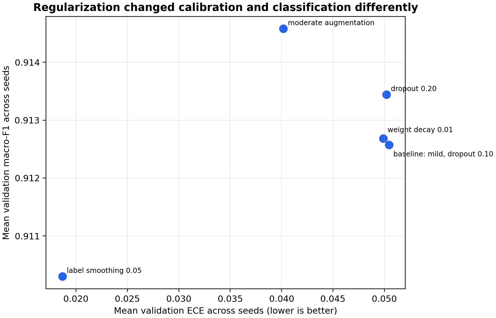
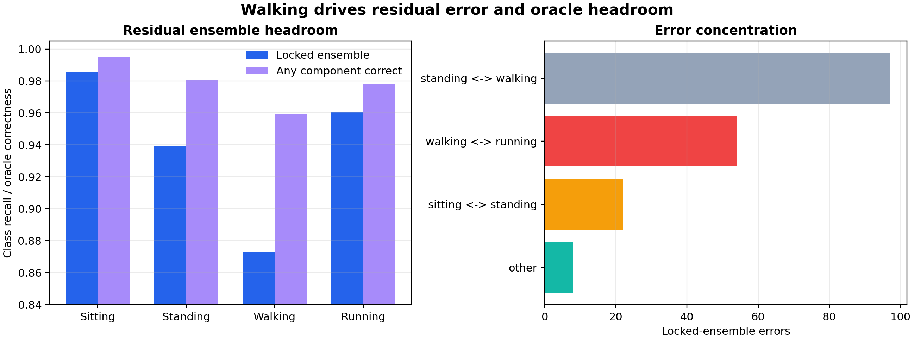
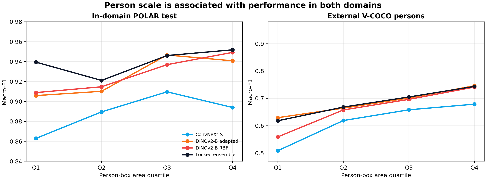
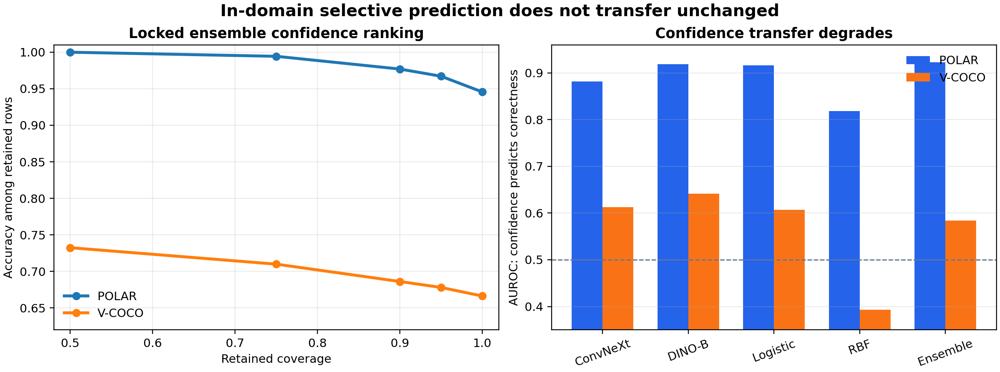
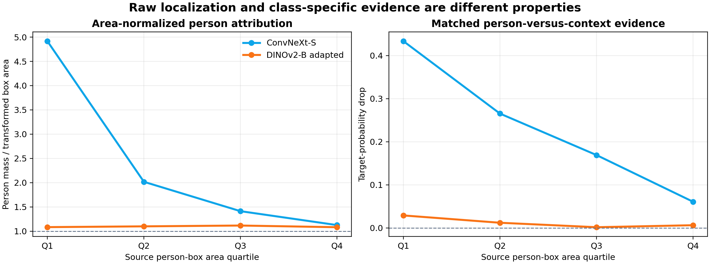

<!-- toc -->

## Abstract

Still-image posture recognition is deceptively difficult to evaluate. Images that look
different can be alternate crops, color variants, or neighboring frames from the same
source; a high in-domain score can coexist with weak transfer; and visually plausible
attribution maps can remain unchanged when their target class or model parameters are
altered. This study addresses those problems in a four-class subset of POLAR containing
sitting, standing, walking, and running. Before supervised fitting, a content audit
quarantined 125 images belonging to 61 confirmed cross-split source-related components.
All model, classifier, and ensemble decisions were then made on 13,285 development
images. Nine neural fits and three frozen-feature probes were hash-verified before a
one-time evaluation on 3,329 held-out test images.

The locked five-component probability ensemble reached 0.9399 macro-F1 (95% stratified
bootstrap confidence interval [0.9312, 0.9481]) and 0.9456 accuracy. Its paired
macro-F1 interval was positive against each component. A calibrated RBF support vector
machine was the strongest individual component at 0.9274 macro-F1, while multinomial
logistic regression was substantially smaller, faster to fit, and better calibrated.
A fixed frozen-representation scale study increased from 0.8487 to 0.9150 validation
macro-F1 between 242 and 9,958 training images. The largest class-level gains occurred
for walking and standing, yet 95.6% of final ensemble errors still lay between adjacent
posture or motion states.

The locked V-COCO transfer evaluation, preceded by a separate cross-dataset overlap
audit, produced 0.6669 image-level macro-F1 for the collapsed ensemble and 0.6732 for
adapted DINOv2-B. Post-hoc,
non-selective analyses show that the gap combines several effects: smaller people,
non-exclusive source actions forced into a three-class mapping, systematic
standing-to-locomotion errors, and the inability of a full-frame model to vary
predictions between people in the same image. Model disagreement was useful for
detecting in-domain errors but much less
informative under external shift, where many errors were unanimous. In the attribution
audit, ConvNeXt Grad-CAM showed substantially greater target and parameter sensitivity
than DINOv2-B integrated gradients. Bounded random bit flips caused few label changes,
concentrated near ambiguous decision boundaries.

The central result is a 0.9399 macro-F1 system supported by selection locking,
source-overlap control, paired uncertainty, external evaluation, explanation sanity
checks, and versioned evidence.

## 1. Scope and contributions

The practical objective is to recognize four coarse human states from a single RGB
image. The scientific objective is broader: to identify which apparent improvements
remain credible after controlling selection, source overlap, random-seed variation,
and evaluation uncertainty, and to determine where the resulting system fails.

The study asks six questions:

1. How does performance change across fixed training-set sizes?
2. When do full or partial backbone adaptation and frozen representations offer the
   better accuracy-cost tradeoff?
3. Does a nonlinear SVM add useful separation after DINOv2 feature extraction?
4. Does a development-locked probability blend improve on its components?
5. Which error structures persist as data and model capacity increase?
6. Do in-domain accuracy, external transfer, attribution faithfulness, and bounded
   fault stability support the same conclusions?

The work makes five evidence-backed contributions.

- It provides a source-overlap-controlled four-class POLAR benchmark with hash-locked
  manifests, a pre-fit quarantine, a one-time test gate, and paired uncertainty.
- It compares three adapted neural configurations and two frozen-feature classifiers within
  one selection protocol, including an explicit efficiency analysis.
- It reports evidence about additional data separately from regularization, adaptation,
  seed averaging, and probability blending.
- It evaluates the locked system under a second dataset, explanation sanity checks,
  and exact bounded bit-flip interventions rather than relying on in-domain accuracy
  alone.
- It assembles portable metrics, exclusion records, selection locks, provenance,
  hashes, and figure-generation code while keeping rights-sensitive and bulky data
  local.

Together, these contributions define a controlled empirical study spanning model
development, evaluation, transfer, interpretability, and reproducibility.

## 2. Related work

### 2.1 Still-image posture and action recognition

POLAR was introduced as a posture-level action recognition dataset spanning nine
classes and substantial variation in person scale, scene, and viewpoint [1, 2]. The
present study uses four labels and applies a content-based split audit. Its label scope
and split construction therefore differ from the original POLAR protocol.

V-COCO extends COCO with person-centric action annotations and was designed for visual
semantic role labeling rather than mutually exclusive posture classification [3].
Using V-COCO here therefore creates a deliberately imperfect external stress test.
Source actions are mapped to sitting, standing, or a collapsed walking/running class,
and the report preserves the semantic mismatch rather than presenting the result as a
standard V-COCO benchmark.

Recent pose-based industrial action-recognition work by Huang et al. combines an
improved YOLO-Pose detector with recurrent modeling and evaluates it on the privately
constructed 12-class SKPose dataset [4]. The study is useful methodological context,
but differences in labels, temporal construction, splits, dataset access, and metrics
prevent a direct ranking. This report confines quantitative comparisons to candidates
evaluated on the same locked rows.

### 2.2 Transfer representations and adaptation

DINOv2 learns general-purpose visual features without task-specific supervision and
has shown strong transfer across image recognition tasks [5]. ConvNeXt modernizes a
convolutional design using training and architectural choices associated with vision
transformers [6]. Their different inductive biases motivate their joint use here:
DINOv2 models operate on a person-centered crop with context, whereas ConvNeXt retains
the full frame.

ImageNet performance often correlates with transfer performance, but transfer quality
also depends on the target task, the representation layer, and the adaptation
procedure [7]. Fine-tuning can improve in-domain fit while altering features in ways
that do not necessarily help distribution shift [8]. Intermediate or multilayer
features can also outperform a final-layer-only representation for downstream
classification [9]. These findings motivate the controlled comparison among full
adaptation, partial adaptation, a frozen multilayer representation, and simple
downstream classifiers.

### 2.3 Classifiers, calibration, and ensembles

The support vector machine remains a strong nonlinear classifier when a useful
representation is already available [10]. The relevant engineering question is not
whether an RBF decision boundary can improve a score in isolation, but whether the
increment justifies calibration cost, support-vector storage, and inference
complexity. This study therefore retains both a calibrated RBF SVM and a multinomial
logistic probe.

Modern neural classifiers can be poorly calibrated even when their accuracy is high
[11]. Probability averaging across independently trained models often improves both
predictive accuracy and uncertainty quality [12]. The present ensemble combines model
families, input views, adaptation levels, and classifier heads, with weights selected
only from development predictions.

### 2.4 Evaluation under shift and explanation audits

Near-duplicate images can materially inflate held-out image recognition results when
related content crosses partitions [13]. Domain-generalization research has likewise
shown how easily model-selection choices confound conclusions about robustness [14].
Accuracy under natural distribution shift often tracks, but does not perfectly follow,
in-domain accuracy [15, 16]. These observations motivate a source audit, a locked test
gate, and an external dataset rather than a single random split.

Integrated gradients and Grad-CAM are widely used to visualize model evidence [17,
18]. Visual plausibility alone is insufficient: saliency methods should respond to
changes in the target function and learned parameters [19], and perturbation metrics
require appropriate controls [20, 21]. This study reports target sensitivity,
parameter randomization, deletion and insertion behavior, and person-region
localization separately. It does not treat an attribution map as an explanation merely
because it resembles a person mask.

Finally, targeted bit manipulation can severely damage quantized neural networks under
adversarial fault models [22, 23]. The fault experiment in this repository is much
narrower. It measures local stability to declared random bit flips at specific inputs
and classifier matrices.

## 3. Data and source-overlap controls

### 3.1 Primary task

The source dataset contains 35,324 annotated images across nine posture-level actions.
The locked task retains images labeled sit, stand, walk, or run and maps them to
sitting, standing, walking, and running. Walking and running are also collapsed for a
secondary three-class transfer task.

| Clean split | Sitting | Standing | Walking | Running | Total |
| --- | ---: | ---: | ---: | ---: | ---: |
| Train | 3,021 | 2,720 | 1,994 | 2,223 | 9,958 |
| Validation | 1,000 | 967 | 648 | 712 | 3,327 |
| Test | 1,034 | 921 | 638 | 736 | 3,329 |
| Total | 5,055 | 4,608 | 3,280 | 3,671 | 16,614 |

The class distribution is not uniform, so macro-F1 is the primary metric. Accuracy,
balanced accuracy, weighted F1, per-class precision and recall, log loss, multiclass
Brier score, and 15-bin expected calibration error (ECE) provide complementary views.

### 3.2 Content audit and quarantine

The source split was not assumed to be independent merely because filenames differed.
The audit first checked byte hashes and then retrieved visually related candidates.
Candidate cross-split pairs had to satisfy both a 64-bit perceptual-hash distance of at
most six and a resized grayscale correlation of at least 0.90. Frozen DINOv2
embeddings proposed additional candidates, but embedding proximity alone was never
used as an exclusion rule.

The audit confirmed 64 source-related cross-split pairs forming 61 connected
components. Every image belonging to a confirmed component was quarantined, removing
125 images before supervised fitting. The locked clean manifest contains 16,614 rows.
Quarantined test content was not reassigned to development.

This procedure controls the relationships found by the declared retrieval and
confirmation rules. Subject and capture-session identifiers were unavailable, and
source relationships outside the retrieval thresholds may remain. The report therefore uses the terms
source-overlap-controlled and leakage-audited rather than leakage-free.

### 3.3 External data

V-COCO train and validation annotations provide a separate three-class audit.
The local manifest contains 6,640 mapped person annotations in 4,123 images.
Image-level evaluation uses 3,761 images whose relevant people agree on one mapped
label. Images with mixed mapped person labels remain in the person-level analysis.

The fixed mapping assigns `sit` to sitting, `stand` to standing, and either `walk` or
`run` to the combined walking/running label. Locomotion takes precedence when `stand`
co-occurs with `walk` or `run`; rows containing only `{sit, stand}` are excluded.
Image-level probabilities are averaged across mapped people only when those people
share one mapped label; all 6,640 mapped rows remain in the person-level analysis.

A separate cross-dataset audit compared all 16,614 clean POLAR images against all
4,123 V-COCO images. It found no byte-identical matches, no perceptual candidates
within the declared threshold, and no confirmed source-related pairs. This excludes
the detected forms of direct content overlap; it does not make the domains
semantically equivalent.

## 4. Locked experimental design

### 4.1 Selection boundary

The official training split fitted candidates, and the validation split made every
modeling decision. Search proceeded in bounded stages:

- frozen probes screened label mappings, full-frame and person-context views, and
  class-balance choices;
- adaptation runs compared head-only, last-stage or top-four-block, and full-backbone
  training;
- controlled regularization runs examined dropout, augmentation, MixUp [27], label
  smoothing, class weighting, weight decay, and random erasing;
- seeds 42, 52, and 62 confirmed competitive settings;
- DINOv2-B entered through a predeclared capacity extension;
- classifier settings and ensemble weights were selected from development
  predictions only.

Macro-F1 was the primary selector. Differences smaller than 0.002 were treated as a
practical tie. Declared tie breakers considered seed variability, log loss, ECE, and
cost. Training failures were retained in the run ledger rather than removed.

After selection, the clean training and validation partitions were combined for the
final fits. Nine neural checkpoints and three classifier probes were checked against
their request, source, and artifact hashes. The test cache then opened once. No test
score changed a model, weight, threshold, epoch count, or attribution method.

### 4.2 Neural components

| Model | View | Adaptation | Augmentation | Dropout | Final epochs |
| --- | --- | --- | --- | ---: | ---: |
| ConvNeXt-S | Full frame | Full backbone, layer decay 0.70 | Mild | 0.10 | 12 |
| DINOv2-S | Person plus 25% context | Full backbone, layer decay 0.75 | Moderate | 0.10 | 12 |
| DINOv2-B | Person plus 25% context | Top four blocks | Mild | 0.10 | 7 |

Each neural component averages probabilities across three independently seeded final
fits. The fixed epoch counts are the median best epochs from the relevant confirmation
runs. The final fit ledger records a combined runtime of 11,557 seconds for the nine
neural fits and three probes.

### 4.3 Frozen DINOv2-B representation and probes

The frozen representation concatenates normalized class tokens from the last four
transformer layers and the normalized mean patch token from the final layer. Features
from a full-frame view and a person crop with 10% context are concatenated, producing
7,680 dimensions.

Two downstream classifiers were retained:

- standardized multinomial logistic regression with C = 0.001 and balanced class
  weights;
- an RBF SVM with C = 10 and gamma = 1/7,680, followed by five-fold sigmoid
  calibration.

The RBF hyperparameters were transferred from the declared development screen rather
than retuned after constructing the final representation.

### 4.4 Locked probability blend

| Component | Weight |
| --- | ---: |
| ConvNeXt-S, full adaptation | 0.20 |
| DINOv2-S, full adaptation with moderate augmentation | 0.15 |
| DINOv2-B, top-four-block adaptation | 0.25 |
| DINOv2-B multilayer logistic probe | 0.20 |
| DINOv2-B multilayer calibrated RBF SVM | 0.20 |

The weights are an arithmetic blend of class probabilities. They were selected on
validation predictions in increments of 0.05 using macro-F1, followed by log loss and
ECE. No subsequent post-hoc analysis alters this blend.

### 4.5 Uncertainty and analysis roles

Locked estimates use 10,000 class-stratified bootstrap resamples with seed 20260822.
Candidate comparisons use paired resamples of the same rows. The external image-level
audit uses the corresponding locked external bootstrap.

Analyses added after the test evaluation are labeled post hoc and non-selective. They
reuse fixed predictions to explain observed behavior and leave the selected model and
primary result unchanged. Post-hoc intervals reported below use 10,000 resamples with
analysis-specific fixed seeds. Unadjusted exploratory p-values, where reported in
portable files, are descriptive.

## 5. Development evidence

### 5.1 Training-set scale

The fixed scale experiment uses frozen DINOv2-B full-frame and 10%-context features
with standardized multinomial logistic regression (C = 0.01, no class weighting)
across nested, class-stratified training subsets. Validation macro-F1 rose monotonically
from 0.8487 with 242 rows to 0.9150 with all 9,958 training rows.

| Training rows | Validation macro-F1 |
| ---: | ---: |
| 242 | 0.8487 |
| 500 | 0.8718 |
| 1,000 | 0.8810 |
| 3,000 | 0.8980 |
| 9,958 | 0.9150 |

The exported run table contains three records per size, but those records share the
same subset hash, output, and macro-F1 at each size. They are repeated executions of
one deterministic nested subset curve, not three independent sample draws. The
evidence therefore supports a five-point descriptive curve, not a variance estimate or
a scaling law.

Post-hoc, non-selective decomposition shows that the gain from 242 to 9,958 rows was
largest for walking (+0.0990 class F1) and standing (+0.0809), followed by running
(+0.0478) and sitting (+0.0378). Walking and standing account for approximately 67.7%
of the summed class-F1 improvement. More data reduced the number of errors, but it did
not change their basic topology: adjacent-state errors represented 88.1% of errors at
242 rows and 90.7% at 9,958 rows. Within this fixed pipeline, the curve is consistent
with improved boundary placement as labeled rows increase, while the underlying
still-image ambiguity remains.

### 5.2 Adaptation and capacity

A post-hoc, non-selective synthesis of the development runs does not support a rule
that more trainable parameters always produce a better model. For DINOv2-B at seed 42,
full adaptation reached 0.9245 validation macro-F1, while top-four-block adaptation
reached 0.9240. The top-four variant trained 28.4 million of 86.6 million parameters,
approximately 32.8% of the model's parameters, and completed about 20.9% faster. This
is a practical tie with a substantial resource difference.

DINOv2-S behaved differently. Full adaptation reached 0.9184 at seed 42, compared with
0.9168 for top-four adaptation. The partial variant also ran longer in that comparison
because its selected epoch was later. ConvNeXt-S showed a clearer dependence on
adaptation depth: full adaptation reached 0.8920 validation macro-F1, compared with
0.8643 for last-stage training and 0.8059 for a head-only fit.

These are pipeline-specific observations. They do not isolate architecture from input
view, schedule, or pretrained representation. They show that trainable fraction by
itself is an inadequate predictor of accuracy or wall-clock cost.

### 5.3 Post-hoc, non-selective regularization synthesis

The underlying DINOv2-S regularization variants were evaluated in the development
stage. The following post-hoc synthesis compares the five specifications with complete
three-seed evidence.

| Variant | Mean macro-F1 | Seed SD | Mean log loss | Mean ECE |
| --- | ---: | ---: | ---: | ---: |
| Mild augmentation, dropout 0.10 | 0.9126 | 0.0055 | 0.3227 | 0.0505 |
| Moderate augmentation | **0.9146** | 0.0049 | 0.2710 | 0.0402 |
| Dropout 0.20 | 0.9134 | 0.0061 | 0.3282 | 0.0502 |
| Label smoothing 0.05 | 0.9103 | **0.0035** | **0.2579** | **0.0187** |
| Weight decay 0.01 | 0.9127 | 0.0055 | 0.3220 | 0.0499 |

Moderate augmentation gave the highest mean macro-F1 and improved probability quality
relative to the baseline. Label smoothing [25] sacrificed about 0.23 macro-F1
percentage points relative to the baseline while sharply improving ECE and log loss. It is
therefore inaccurate to classify every lower-F1 intervention as a failed
regularizer; the ranking depends on whether the objective is classification,
calibration, stability, or cost.

There is an important DINOv2-S selection distinction. The individual multi-seed
selector chose the top-four variant because it lay within the 0.002 practical-tie band
and had the lowest seed standard deviation. The later development-only blend search,
however, assigned that DINOv2-S top-four candidate zero weight and assigned 0.15 to the
moderate full-adaptation candidate. The final ensemble therefore uses the moderate
variant because it contributed to the system-level validation blend, not because it
won the standalone confirmation ranking.

### 5.4 Post-hoc, non-selective seed-averaging synthesis

Averaging three final seed probabilities produced small, consistent gains over the
mean of individual seed macro-F1 values: approximately +0.0013 for ConvNeXt-S, +0.0010
for DINOv2-B, and +0.0019 for DINOv2-S. Log loss and ECE also improved. These increments
are modest compared with the scale effect, but they are low-risk once multiple final
fits already exist.

## 6. Locked in-domain evaluation

### 6.1 Primary result

| Candidate | Macro-F1 | 95% CI | Accuracy | Log loss | ECE |
| --- | ---: | ---: | ---: | ---: | ---: |
| Locked ensemble | **0.9399** | [0.9312, 0.9481] | **0.9456** | **0.1564** | 0.0291 |
| DINOv2-B multilayer RBF SVM | 0.9274 | [0.9179, 0.9362] | 0.9342 | 0.2280 | 0.0269 |
| DINOv2-B multilayer logistic | 0.9258 | [0.9164, 0.9348] | 0.9324 | 0.1764 | **0.0133** |
| DINOv2-B top four | 0.9252 | [0.9156, 0.9343] | 0.9327 | 0.2173 | 0.0420 |
| DINOv2-S full | 0.9131 | [0.9028, 0.9226] | 0.9210 | 0.2389 | 0.0298 |
| ConvNeXt-S full | 0.8914 | [0.8803, 0.9020] | 0.8994 | 0.3081 | 0.0429 |

The ensemble's paired macro-F1 gain was +0.0484 over ConvNeXt-S, +0.0268 over
DINOv2-S, +0.0147 over adapted DINOv2-B, +0.0141 over logistic regression, and +0.0125
over the RBF SVM. All five locked paired 95% intervals were above zero. The narrowest
comparison was against the RBF SVM, with interval [0.0065, 0.0186].

For the secondary task, collapsing walking and running after inference produced 0.9611
macro-F1 and 0.9622 accuracy. A direct three-class logistic probe reached 0.9531
macro-F1. This secondary comparison was locked and uses the same test rows; it does not
establish performance on unrelated three-class activity taxonomies.

### 6.2 Per-class behavior

| Class | Precision | Recall | F1 | Support |
| --- | ---: | ---: | ---: | ---: |
| Sitting | 0.992 | 0.985 | 0.989 | 1,034 |
| Standing | 0.925 | 0.939 | 0.932 | 921 |
| Walking | 0.887 | 0.873 | 0.880 | 638 |
| Running | 0.957 | 0.961 | 0.959 | 736 |

Walking is the limiting class. Of 638 walking examples, 52 were predicted as standing
and 28 as running. A post-hoc, non-selective interpretation is that sitting and running
form more visually distinctive endpoints in this descriptive label ordering.

### 6.3 Post-hoc, non-selective error topology

The four labels have a natural descriptive order:

sitting <-> standing <-> walking <-> running.

This order was not used as a loss function or selection constraint. It is applied after
evaluation to summarize the confusion matrix. Of the ensemble's 181 errors, 173
(95.6%) occur between adjacent states. Standing and walking account for 97 errors
(53.6% of all errors), walking and running for 54 (29.8%), and sitting and standing for
22 (12.2%). Only eight errors cross more than one boundary.

The result suggests that the remaining difficulty is structured rather than random.
A still frame can show a person between gait phases, standing immediately before
motion, or partially seated. The same adjacent-state concentration appears along the
fixed scale curve and in the highest-rate fault diagnostic. This recurring pattern
supports future work on ordinal objectives, temporal evidence, or uncertainty around
transition states. The present task continues to treat the source labels as nominal
classes.

### 6.4 Post-hoc, non-selective ensemble structure

At least one of the five components was correct on 98.05% of test images, compared with
94.56% accuracy for the realizable fixed blend. This 3.48 percentage-point oracle gap
is an upper-bound diagnostic: it assumes knowledge of the true label for choosing a
component and is not a deployable result.

Component disagreement occurred on 15.74% of test images. It was highest for walking
at 33.07%, compared with 18.57% for standing, 11.41% for running, and 5.61% for
sitting. The oracle and disagreement results show that the net improvement is an
aggregate consequence of complementary errors, not a guarantee that blending improves
every row.

The exact validation-selected weights are not uniquely important. An equal-weight
average reached 0.9395 macro-F1, only 0.00034 below the locked 0.9399 result, and agreed
with it on 99.76% of predictions. The post-hoc paired interval for locked minus equal
weights is [-0.0012, 0.0020]. In contrast, removing any one component reduced macro-F1 by
approximately 0.0019 to 0.0029. Taken together, these checks indicate that the
component set is more consequential than fine adjustment of the five weights.

### 6.5 Post-hoc, non-selective selective prediction

Maximum probability is informative in-domain. The locked ensemble's confidence had an
area under the ROC curve of 0.9225 for distinguishing correct from incorrect
predictions. Retaining the 90% most confident test rows yielded 0.9770 selective
accuracy, compared with 0.9456 at full coverage.

This analysis is descriptive and does not define an operational rejection threshold.
Coverage was examined after the test result, no cost for abstention was specified, and
calibration can shift across domains. The external analysis below confirms that this
caution is necessary.

## 7. Classifier and system tradeoffs

### 7.1 Linear and nonlinear frozen-feature probes

| Probe | Test macro-F1 | Test log loss | External image macro-F1 | Fit time | Serialized probe |
| --- | ---: | ---: | ---: | ---: | ---: |
| Multinomial logistic | 0.9258 | **0.1764** | 0.6392 | **13.9 s** | **0.4 MB** |
| Calibrated RBF SVM | **0.9274** | 0.2280 | **0.6504** | 60.4 min | 870.9 MB |

The RBF SVM adds 0.0016 macro-F1 in-domain. Its post-hoc paired interval against
logistic regression is [-0.0051, 0.0085], leaving the difference statistically
unresolved. The RBF probe also requires five calibrated fits,
approximately 5,038 support vectors per fold, and over 2,000 times more serialized
classifier storage.

The storage figures in the table cover only the downstream classifiers. Both require
the same DINOv2-B feature extractor, approximately 346 MB of shared backbone weights,
as well as the cost of two-view feature extraction. Omitting that common cost would
make the logistic alternative look like a standalone sub-megabyte vision system, which
it is not.

Logistic regression is the stronger default where calibration, fit time, storage, or
maintainability dominates. The RBF SVM remains useful as a research component because
its nonlinear boundary contributes a different probability surface to the blend.

### 7.2 Post-hoc, non-selective adapted-versus-frozen pipeline comparison

Adapted DINOv2-B, logistic regression, and the RBF SVM are effectively tied in-domain
at the resolution of their paired intervals: [-0.0097, 0.0088] for adapted minus
logistic and [-0.0114, 0.0070] for adapted minus RBF. On V-COCO images, adapted
DINOv2-B exceeds the logistic probe by 0.0340 macro-F1 (95% interval [0.0242, 0.0442])
and the RBF probe by 0.0228 (95% interval [0.0125, 0.0333]).

This contrast is suggestive but not an adaptation-only causal comparison. The adapted
model uses a person crop with 25% context and a learned classification head, whereas
the frozen probes concatenate full-frame and 10%-context features from several layers.
The result supports a narrower hypothesis: the adapted DINOv2-B pipeline preserves
more useful behavior under this particular external shift, even though the three
pipelines are nearly indistinguishable on POLAR.

## 8. External transfer

### 8.1 Locked V-COCO results

| V-COCO image-level candidate | Macro-F1 | 95% CI | Accuracy | Log loss |
| --- | ---: | ---: | ---: | ---: |
| DINOv2-B top four | **0.6732** | [0.6609, 0.6849] | **0.6751** | 1.7509 |
| Locked ensemble, collapsed | 0.6669 | [0.6550, 0.6787] | 0.6663 | **1.2512** |
| DINOv2-B multilayer RBF | 0.6504 | [0.6380, 0.6623] | 0.6453 | 2.0801 |
| DINOv2-S full | 0.6455 | [0.6329, 0.6579] | 0.6472 | 1.6232 |
| Direct three-class probe | 0.6430 | [0.6309, 0.6545] | 0.6405 | 1.2775 |
| DINOv2-B multilayer logistic | 0.6392 | [0.6274, 0.6507] | 0.6363 | 1.4022 |
| ConvNeXt-S full | 0.6208 | [0.6073, 0.6337] | 0.6272 | 1.8414 |

The collapsed in-domain ensemble reaches 0.9611 macro-F1, whereas the same locked
probabilities yield 0.6669 on V-COCO images. The 0.2942 gap is the most consequential
negative result in the study. It prevents the in-domain score from being interpreted
as evidence of general deployment performance.

The external ranking also changes. Adapted DINOv2-B has the highest image-level
macro-F1, exceeding the ensemble by 0.0063, but their post-hoc paired interval
[-0.0016, 0.0141] includes zero. The ensemble has substantially better log loss and ECE
than adapted DINOv2-B.
There is therefore no single external winner across discrimination and probability
quality.

At person level, adapted DINOv2-B reaches 0.6853 macro-F1 and the ensemble reaches
0.6840. Person-level evaluation retains all 6,640 mapped people, including those from
images with mixed person labels. These values cannot be compared directly with
standard V-COCO role average precision because the task, mapping, unit of analysis,
and metric differ.

### 8.2 Post-hoc, non-selective person-scale analysis

Person boxes are materially smaller in V-COCO. Across the mapped data, the median
person-box area is 0.145 of image area in V-COCO and 0.296 in POLAR, a ratio of 0.492.
Half of V-COCO people are smaller than the first POLAR box-area quartile threshold.
Class-specific median ratios are 0.611 for sitting, 0.405 for standing, and 0.488 for
walking/running.

On POLAR, the locked ensemble macro-F1 is 0.9394 in the smallest-box quartile and
0.9518 in the largest. The RBF probe changes more sharply, from 0.9089 to 0.9492. The
ensemble's 0.0305 advantage over the RBF probe in the smallest quartile has a positive
post-hoc paired interval [0.0168, 0.0452]. The unadjusted descriptive Spearman
correlation between box-area fraction and binary prediction correctness is 0.066 for
the ensemble and 0.085 to 0.139 for individual components. The ensemble shows the
weakest observed size association among the evaluated candidates.

V-COCO person-level ensemble macro-F1 rises from 0.6181 in the smallest external
quartile to 0.7435 in the largest. Even the largest-person group remains far below the
in-domain result. Person scale is therefore one contributor to the transfer gap, not a
complete explanation.

As a check for annotation geometry signal, a post-hoc fixed multinomial logistic
baseline used only five ground-truth annotation features: log box area, log box aspect
ratio, box-center x and y coordinates, and log image aspect ratio. It reached 0.4310
macro-F1 on POLAR test (95% interval [0.4140, 0.4478]), above the majority-class
descriptive reference but far below the visual models. When
transferred without retuning to V-COCO people, it reached 0.3073 macro-F1 and predicted
the locomotion class for 71.3% of rows. Geometry carries label-correlated information
within POLAR, but its relationship to the mapped classes shifts across datasets.
Because the baseline requires ground-truth boxes, it is a diagnostic rather than a
deployable method.

### 8.3 Post-hoc, non-selective semantic-mapping analysis

V-COCO actions are not mutually exclusive. Of 1,261 person rows mapped to
walking/running, 1,174 (93.1%) also carry the source action stand. At image level,
584 of 621 locomotion images (94.0%) have at least one relevant person with a stand
co-tag, and 562 (90.5%) have stand tags for every relevant person.

The forced three-class mapping interacts with a strong external error direction. The
ensemble produces 1,039 standing-to-locomotion errors, representing 82.8% of its 1,255
image-level errors. Its locomotion recall is 0.915 for stand-co-tagged person rows and
0.977 for the 87 locomotion rows without a stand co-tag.

These counts do not show that co-tagging alone causes the standing errors. They show
that the external label space mixes posture and action semantics that POLAR treats as
separate exclusive states. The V-COCO result is best read as transfer under a
partially incompatible annotation policy, not as a pure estimate of visual domain
shift.

### 8.4 Post-hoc, non-selective multi-person analysis

There are 354 V-COCO images containing more than one mapped person label, covering
1,039 person rows. A full-frame ConvNeXt prediction is identical for every person in
the same image by construction. It consequently shows zero within-image prediction
variation and reaches 0.4793 person-level macro-F1 in these mixed scenes.

DINOv2-B top-four adaptation uses a person-conditioned crop. Its predictions differ
between people in 171 of the 354 images and reach 0.6411 macro-F1. The post-hoc
cluster-bootstrap difference from ConvNeXt is +0.1619 macro-F1 (95% interval
[0.1300, 0.1943]) when images, rather than individual people, are resampled. DINOv2-S
shows comparable behavior, varying in 175 mixed images and reaching 0.6416 macro-F1.

This is a functional difference between input pipelines, not evidence that transformer
architecture alone is responsible. When an image contains people with different
labels, a person-conditioned view can represent the evaluation unit, whereas a single
full-frame prediction cannot.

### 8.5 Post-hoc, non-selective consensus and confidence under shift

On POLAR, components disagree on 15.7% of rows. The ensemble error rate is 2.0% when
all components agree and 23.9% when they disagree. Disagreement has an error-detection
AUROC of 0.782, and ensemble confidence has correctness AUROC 0.923.

On V-COCO, disagreement rises to 31.0%, but its diagnostic value falls. The ensemble
error rate is already 28.5% on unanimous rows and 44.3% on disagreement rows;
disagreement AUROC is 0.576 and confidence correctness AUROC is 0.584. Of 738 unanimous
external errors, 684 (92.7%) are standing-to-locomotion.

The contrast is important. In-domain errors are often associated with recognizable
model uncertainty or disagreement. Under external shift, many errors become shared
and systematic, so neither confidence filtering nor a fixed ensemble can reliably
identify them. At 90% confidence coverage, ensemble accuracy is 0.9770 on POLAR but
only 0.6862 on V-COCO. The external figure is an exploratory diagnostic, not a
validated rejection policy.

## 9. Attribution faithfulness

### 9.1 Protocol

The locked audit uses 256 deterministic test images, balanced across the four classes
and four source-box-area quartiles. ConvNeXt-S is evaluated with Grad-CAM and
DINOv2-B with 16-step integrated gradients. Both methods target the model's locked
predicted class. Perturbation operates on an 8 by 8 grid with a nested random-deletion
control.

The audit reports distinct questions rather than a single explanation score:

- deletion and insertion behavior;
- targeted deletion relative to a random-deletion baseline;
- raw attribution mass in the person box;
- attribution mass divided by box-area share;
- pointing-game localization;
- equal-area person versus context occlusion;
- consistency between full and cropped views;
- sensitivity to an alternative target class;
- sensitivity to randomized classifier and adapted-layer parameters.

### 9.2 Predeclared auxiliary diagnostic results

| Metric | ConvNeXt-S Grad-CAM | DINOv2-B integrated gradients |
| --- | ---: | ---: |
| Deletion AUC, lower is better | 0.615 | 0.874 |
| Random deletion AUC | 0.778 | 0.932 |
| Random minus targeted deletion gap | **0.163** | 0.058 |
| Insertion AUC, higher is better | 0.896 | **0.946** |
| Person attribution mass | 0.691 | **0.848** |
| Person mass divided by box area | **2.368** | 1.095 |
| Pointing-game rate | **0.859** | 0.828 |
| Person minus context probability drop | **0.234** | 0.012 |
| Alternative-target Spearman rho | **-0.491** | 0.934 |
| Randomized-head Spearman rho | **0.183** | 0.871 |
| Randomized-adapted-layers Spearman rho | **0.135** | 0.708 |

All entries are arithmetic means. The main attribution and perturbation metrics use
256 rows per family; matched person-context occlusion uses 254 because two rows per
family have no equal-area context region; and each parameter-randomization correlation
uses 16 rows per family.

ConvNeXt provides the stronger evidence under this protocol. Its targeted deletion is
more selective than random deletion, person attribution exceeds what box area alone
would imply, person occlusion has a larger effect than matched context, and maps change
substantially when the target or learned parameters change.

DINOv2-B integrated gradients place a high fraction of attribution inside the person
crop and achieve high insertion AUC. Those results are insufficient by themselves:
the person occupies much of the analyzed crop, equal-area person occlusion produces
little probability change, and rank correlations remain high after target and
parameter randomization. Under the tested baseline, resolution, and integration rule,
the supported interpretation is coarse person localization rather than strong
class-specific faithfulness.

This is a comparison between complete explanation pipelines, not an
architecture-controlled experiment. ConvNeXt uses a full-frame input and Grad-CAM;
DINOv2 uses a person-context crop and integrated gradients. A different baseline,
layer, attribution family, resolution, or perturbation operator could change the
result.

### 9.3 Post-hoc, non-selective scale confounding

Raw person attribution mass increases with person-box size for both systems. For
ConvNeXt, mean mass rises from 0.477 in the smallest quartile to 0.831 in the
largest, while area-normalized lift falls from 4.916 to 1.125. The Spearman
correlations with box area are +0.543 for raw mass and -0.677 for lift. The matched
person-minus-context probability drop also falls from 0.433 to 0.061.

For DINOv2, mean raw mass rises from 0.808 to 0.901, but lift remains near 1.08 to 1.12
and has no meaningful descriptive correlation with box area (rho = -0.043).
Alternative-target correlations remain approximately 0.93 in every quartile, and
matched person-context occlusion remains close to zero.

The analysis clarifies why raw localization mass should not be interpreted alone.
A large box mechanically captures more attribution, and a person crop further
constrains where pixels can fall. Normalized lift, matched-region perturbation, target
sensitivity, and parameter randomization provide necessary counterchecks. The DINOv2
sanity-check result is not explained by one problematic size quartile.

Two rows per model have projected person boxes covering the full analyzed frame, so no
equal-area context region exists. They remain in every other metric and are excluded
only from that matched-context statistic. The maximum recorded difference between
recomputed attribution-path and locked probabilities is 0.00176.

## 10. Bounded fault response

### 10.1 Intervention

Input faults flip exact random bits in the post-resize uint8 RGB tensor before
normalization. Parameter faults symmetrically quantize each classifier weight matrix
to int8, flip exact bits, run inference, and restore the original float weights.
Three declared fault seeds are averaged. The same 256-row cohort used by the
faithfulness audit supports the diagnostic.

| Condition | ConvNeXt-S agreement | DINOv2-B agreement |
| --- | ---: | ---: |
| Input bit-flip rate 0.00001 | 0.996 | 1.000 |
| Input bit-flip rate 0.0001 | 0.996 | 0.996 |
| Input bit-flip rate 0.001 | 0.984 | 0.980 |
| 16 classifier-matrix flips per seed model | 1.000 | 1.000 |

The models are locally stable under these specific random corruptions. At the highest
input rate, ConvNeXt changes four of 256 labels and DINOv2 changes five.

### 10.2 Post-hoc, non-selective boundary analysis

All five DINOv2 label changes occur on true walking rows. Mean absolute probability
drift is 0.0160 for walking, compared with
0.0026 for sitting, 0.0046 for standing, and 0.0017 for running. The median clean
top-two margin is 0.0855 for changed DINOv2 predictions and 0.9999 for stable
predictions. For ConvNeXt, the corresponding medians are 0.2178 and 0.9961.

Only five DINOv2 changes and four ConvNeXt changes are observed, so the class
concentration is a hypothesis-generating pattern rather than a stable rate estimate.
It nevertheless agrees with the locked confusion matrix: perturbations most often
expose the same walking boundary that limits clean performance.

The experiment does not evaluate targeted progressive bit attacks, corruption in
every backbone tensor, persistent faults, memory layout, hardware error rates, or
recovery. Perfect agreement for the small classifier-matrix intervention is not proof
of fault tolerance. It reports only what happened under the declared bounded
intervention.

## 11. Integrated interpretation

This section is a post-hoc, non-selective synthesis of the locked and exploratory
evidence. It does not revise the selected system or elevate exploratory findings to
confirmatory status.

### 11.1 What produced the in-domain result

The evidence separates four sources of improvement.

First, the largest isolated change measured under a fixed pipeline is associated with
additional labeled data. The frozen-representation curve gains 0.0664 macro-F1 from
242 to 9,958 rows. Walking and standing receive most of that improvement.

Second, representation and input view matter. DINOv2-B supports strong results through
both selective adaptation and frozen multilayer features. ConvNeXt is weaker alone but
provides distinct full-frame errors and stronger attribution sanity evidence.

Third, conservative regularization can prevent regressions or improve probability
quality, but no single intervention explains the final score. Moderate augmentation
gives the best DINOv2-S mean macro-F1; label smoothing gives the best calibration;
larger dropout does not reliably dominate the baseline.

Fourth, probability averaging converts diversity into a locked gain. Seed averaging
adds small increments, and combining five heterogeneous components adds 0.0125
macro-F1 over the strongest standalone RBF component. The equal-weight and
leave-one-out checks suggest that broad component coverage matters more than exact
weight precision.

### 11.2 What remains difficult

The remaining POLAR errors are overwhelmingly concentrated at adjacent posture and
motion boundaries. This structure persists as training size grows. It also appears in
the fault audit. The observation points toward a data and task limitation: a single
frame does not always contain enough temporal evidence to separate standing from
walking or walking from running.

The external results expose a second limitation. Person size changes, annotation
semantics overlap, and full-frame models cannot distinguish multiple people in one
image. More importantly, model errors become systematic: a large number of external
standing examples are unanimously classified as locomotion. Ensembling independent
seeds and model families cannot remove an error shared across all of them.

### 11.3 Defensible hypotheses for future work

The following hypotheses are supported enough to motivate new predeclared experiments,
but not enough to be presented as established causal findings.

1. **Transition-aware labels or temporal input will help the walking boundary more than
   additional generic regularization.** The same adjacent-state errors dominate across
   scale, the final ensemble, and faults.
2. **Person-conditioned views are necessary for person-level evaluation in mixed
   scenes.** This follows from the evaluation unit: full-frame predictions cannot vary
   within an image, whereas crop-conditioned models can.
3. **External calibration requires shift-aware validation.** In-domain confidence and
   disagreement are informative, but both degrade sharply on V-COCO.
4. **Annotation policy is part of the domain.** Non-exclusive V-COCO action tags and
   exclusive POLAR state labels create a semantic shift that image augmentation alone
   cannot resolve.
5. **Attribution localization should be normalized for available area.** Raw person
   mass is strongly confounded by box size and crop construction; target and parameter
   randomization remain necessary.
6. **A compact linear probe is a credible deployment baseline.** The small in-domain
   RBF gain is unresolved by paired uncertainty and carries a large cost, although the
   nonlinear model can still add ensemble diversity.

Testing these hypotheses would require a new protocol, new selection budget, and a
fresh held-out evaluation. None should be retrofitted into the present locked result.

## 12. Limitations and threats to validity

### 12.1 Dataset and split validity

The reported score applies to four of nine POLAR classes. Subject and capture-session
identities are unavailable, and residual source relationships may remain below the
retrieval thresholds used by the source audit.

The external evaluation uses a forced mapping from non-exclusive V-COCO actions to
exclusive posture states. This is useful for stress testing, but it is not a clean
replication of the POLAR task. V-COCO is also not an independently collected posture
benchmark designed for this label set.

### 12.2 Modeling validity

Architecture, view, and attribution method are partly coupled. ConvNeXt uses full
frames; adapted DINOv2 uses person-context crops; frozen probes concatenate two views.
Differences cannot be assigned to architecture alone.

The evaluated search space covers the declared learning rates, crop ratios,
augmentations, backbones, probe kernels, and blend structures. DINOv3 [26], ConvNeXt
V2 [24], pose-specialized systems, ordinal losses, and temporal models remain outside
that search space.

The scale curve contains five deterministic nested subsets. Repeated table rows at a
given size do not provide independent seed variation. A genuine data-scaling study
would draw multiple independent subsets at every size, preserve nesting where needed,
and report variance.

### 12.3 Statistical validity

Locked uncertainty covers finite test-sample variation under class-stratified
resampling. It does not cover uncertainty from dataset construction, undetected source
overlap, alternative task mappings, or all possible training seeds.

Post-hoc analyses reuse the test and external predictions after observing aggregate
results. Their intervals quantify sampling variation for fixed exploratory
specifications; they do not restore confirmatory status. Multiple exploratory
correlations are not corrected for multiplicity.

### 12.4 Explanations and faults

Attribution metrics depend on the chosen baseline, layer, perturbation distribution,
mask resolution, and crop. The reported analysis measures localization and model
sensitivity under those declared choices.

Random input and classifier-matrix bit flips are bounded software interventions.
The tested scope covers input tensors and classifier matrices on the fixed 256-image
cohort.

### 12.5 Reproducibility boundary

The repository is designed to support traceability and retraining, not byte-for-byte
replay of every local result. Raw images, trained checkpoints, fitted classifier binaries, dense
per-example probabilities, and full-resolution attribution arrays remain local because
of dataset rights, size, and privacy boundaries. Portable aggregate results and hashes
allow consistency checks but cannot reconstruct excluded artifacts.

## 13. Reproducibility and availability

The repository targets Python 3.11. The reported run used PyTorch 2.11.0+cu126 and an
NVIDIA GeForce RTX 4060 Laptop GPU. The tracked environment lock, protocols, source
code, tests, lint configuration, and portable validation scripts define the public
retraining surface. Continuous integration runs lint, compilation, tests, and the
portable repository validator on Linux with CPU PyTorch.

The evidence package includes:

- locked train, validation, and test manifest hashes;
- the quarantine list and source-overlap audit;
- development training and failure ledgers;
- candidate selection, confirmation, classifier, and blend locks;
- per-seed and aggregate locked test metrics;
- class-stratified and paired bootstrap summaries;
- external image- and person-level metrics and overlap audit;
- faithfulness curves, randomization checks, and cohort details;
- fault definitions and aggregate outcomes;
- post-hoc exploratory tables and deterministic analysis code;
- a final evidence manifest containing hashes for portable locked artifacts.

Primary entry points are listed in Appendix B. Raw dataset access remains subject to
the original POLAR and V-COCO terms. Versioned archives should attach the rendered
report, preserve the citation metadata, and state the same artifact exclusions. When a
DOI is assigned, it should resolve to an immutable release rather than to a moving
development branch.

## 14. Conclusion

The locked five-component system achieves strong four-class POLAR performance:
0.9399 macro-F1 with a positive paired interval over every component. The result is
supported by the source audit, development-only selection, hash-verified final fits,
one-time test gate, and paired uncertainty, which constrain the usual routes by which
a score can be inflated.

The broader study is more informative than the headline metric. The largest isolated
gain observed under a fixed pipeline accompanies increased training-set size. Walking
and standing remain the central boundary. A
calibrated RBF SVM is marginally stronger than a logistic probe but far less efficient,
and their paired difference is unresolved. Ensemble diversity matters more than
precise weight tuning. Person scale contributes to external degradation, while
annotation semantics and shared model bias explain why large errors remain even when
the models agree. ConvNeXt Grad-CAM shows substantially greater target and parameter
sensitivity under the tested sanity checks than DINOv2 integrated gradients. Random
bit flips concentrate their few label changes near ambiguous class boundaries.

Together, the results establish a controlled four-class POLAR benchmark and a reusable
evaluation workflow for still-image posture recognition. The versioned evidence links
model selection, final fitting, external transfer, attribution behavior, and bounded
fault injection to the reported metrics.

## References

1. Ma, W., and Liang, S. POLAR: Posture-level Action Recognition Dataset. Mendeley
   Data, Version 1. [https://doi.org/10.17632/hvnsh7rwz7.1](https://doi.org/10.17632/hvnsh7rwz7.1)
2. Ma, W., and Liang, S. POLAR: Posture-level Action Recognition Dataset. 2019 6th
   International Conference on Systems and Informatics (ICSAI).
   [https://doi.org/10.1109/ICSAI48974.2019.9010160](https://doi.org/10.1109/ICSAI48974.2019.9010160)
3. Gupta, S., and Malik, J. Visual Semantic Role Labeling. 2015.
   [https://arxiv.org/abs/1505.04474](https://arxiv.org/abs/1505.04474)
4. Huang, W., Wu, M., Chen, W., and Zhou, Q. A Bio-Inspired Lightweight Human
   Action Recognition Method Based on Human Keypoint Detection. Biomimetics, 11(5),
   355, 2026.
   [https://doi.org/10.3390/biomimetics11050355](https://doi.org/10.3390/biomimetics11050355)
5. Oquab, M., et al. DINOv2: Learning Robust Visual Features without Supervision.
   Transactions on Machine Learning Research, 2024.
   [https://openreview.net/forum?id=a68SUt6zFt](https://openreview.net/forum?id=a68SUt6zFt)
6. Liu, Z., et al. A ConvNet for the 2020s. Proceedings of CVPR, 2022.
   [CVPR paper](https://openaccess.thecvf.com/content/CVPR2022/html/Liu_A_ConvNet_for_the_2020s_CVPR_2022_paper.html)
7. Kornblith, S., Shlens, J., and Le, Q. V. Do Better ImageNet Models Transfer Better?
   Proceedings of CVPR, 2019.
   [CVPR paper](https://openaccess.thecvf.com/content_CVPR_2019/html/Kornblith_Do_Better_ImageNet_Models_Transfer_Better_CVPR_2019_paper.html)
8. Kumar, A., et al. Fine-Tuning Can Distort Pretrained Features and Underperform
   Out-of-Distribution. International Conference on Learning Representations, 2022.
   [https://openreview.net/forum?id=UYneFzXSJWh](https://openreview.net/forum?id=UYneFzXSJWh)
9. Evci, U., et al. Head2Toe: Utilizing Intermediate Representations for Better
   Transfer Learning. Proceedings of ICML, 2022.
   [https://proceedings.mlr.press/v162/evci22a.html](https://proceedings.mlr.press/v162/evci22a.html)
10. Cortes, C., and Vapnik, V. Support-Vector Networks. Machine Learning, 1995.
    [https://doi.org/10.1007/BF00994018](https://doi.org/10.1007/BF00994018)
11. Guo, C., Pleiss, G., Sun, Y., and Weinberger, K. Q. On Calibration of Modern
    Neural Networks. Proceedings of ICML, 2017.
    [https://proceedings.mlr.press/v70/guo17a.html](https://proceedings.mlr.press/v70/guo17a.html)
12. Lakshminarayanan, B., Pritzel, A., and Blundell, C. Simple and Scalable
    Predictive Uncertainty Estimation using Deep Ensembles. NeurIPS, 2017.
    [NeurIPS paper](https://papers.nips.cc/paper_files/paper/2017/hash/9ef2ed4b7fd2c810847ffa5fa85bce38-Abstract.html)
13. Barz, B., and Denzler, J. Do We Train on Test Data? Purging CIFAR of
    Near-Duplicates. Journal of Imaging, 2020.
    [https://doi.org/10.3390/jimaging6060041](https://doi.org/10.3390/jimaging6060041)
14. Gulrajani, I., and Lopez-Paz, D. In Search of Lost Domain Generalization.
    International Conference on Learning Representations, 2021.
    [https://openreview.net/forum?id=lQdXeXDoWtI](https://openreview.net/forum?id=lQdXeXDoWtI)
15. Miller, J., et al. Accuracy on the Line: On the Strong Correlation Between
    Out-of-Distribution and In-Distribution Generalization. Proceedings of ICML, 2021.
    [https://proceedings.mlr.press/v139/miller21b.html](https://proceedings.mlr.press/v139/miller21b.html)
16. Taori, R., et al. Measuring Robustness to Natural Distribution Shifts in Image
    Classification. NeurIPS, 2020.
    [NeurIPS paper](https://proceedings.neurips.cc/paper/2020/hash/d8330f857a17c53d217014ee776bfd50-Abstract.html)
17. Sundararajan, M., Taly, A., and Yan, Q. Axiomatic Attribution for Deep Networks.
    Proceedings of ICML, 2017.
    [https://proceedings.mlr.press/v70/sundararajan17a.html](https://proceedings.mlr.press/v70/sundararajan17a.html)
18. Selvaraju, R. R., et al. Grad-CAM: Visual Explanations from Deep Networks via
    Gradient-based Localization. Proceedings of ICCV, 2017.
    [ICCV paper](https://openaccess.thecvf.com/content_ICCV_2017/papers/Selvaraju_Grad-CAM_Visual_Explanations_ICCV_2017_paper.pdf)
19. Adebayo, J., et al. Sanity Checks for Saliency Maps. NeurIPS, 2018.
    [NeurIPS paper](https://proceedings.neurips.cc/paper/2018/hash/294a8ed24b1ad22ec2e7efea049b8737-Abstract.html)
20. Petsiuk, V., Das, A., and Saenko, K. RISE: Randomized Input Sampling for
    Explanation of Black-box Models. BMVC, 2018.
    [BMVC paper](https://www.bmvc2018.org/contents/papers/1064.pdf)
21. Rong, Y., et al. A Consistent and Efficient Evaluation Strategy for Attribution
    Methods. Proceedings of ICML, 2022.
    [https://proceedings.mlr.press/v162/rong22a.html](https://proceedings.mlr.press/v162/rong22a.html)
22. Rakin, A. S., He, Z., and Fan, D. Bit-Flip Attack: Crushing Neural Network with
    Progressive Bit Search. Proceedings of ICCV, 2019.
    [ICCV paper](https://openaccess.thecvf.com/content_ICCV_2019/html/Rakin_Bit-Flip_Attack_Crushing_Neural_Network_With_Progressive_Bit_Search_ICCV_2019_paper.html)
23. Hong, S., et al. Terminal Brain Damage: Exposing the Graceless Degradation in Deep
    Neural Networks Under Hardware Fault Attacks. USENIX Security, 2019.
    [USENIX paper](https://www.usenix.org/conference/usenixsecurity19/presentation/hong)
24. Woo, S., et al. ConvNeXt V2: Co-designing and Scaling ConvNets with Masked
    Autoencoders. Proceedings of CVPR, 2023.
    [CVPR paper](https://openaccess.thecvf.com/content/CVPR2023/html/Woo_ConvNeXt_V2_Co-Designing_and_Scaling_ConvNets_With_Masked_Autoencoders_CVPR_2023_paper.html)
25. Muller, R., Kornblith, S., and Hinton, G. E. When Does Label Smoothing Help?
    NeurIPS, 2019.
    [NeurIPS paper](https://proceedings.neurips.cc/paper/2019/hash/f1748d6b0fd9d439f71450117eba2725-Abstract.html)
26. Simeoni, O., et al. DINOv3. arXiv:2508.10104, 2025.
    [https://arxiv.org/abs/2508.10104](https://arxiv.org/abs/2508.10104)
27. Zhang, H., Cisse, M., Dauphin, Y. N., and Lopez-Paz, D. mixup: Beyond Empirical
    Risk Minimization. International Conference on Learning Representations, 2018.
    [https://openreview.net/forum?id=r1Ddp1-Rb](https://openreview.net/forum?id=r1Ddp1-Rb)

## Appendix A. Compact methods specification

### A.1 Tasks and views

| Item | Locked specification |
| --- | --- |
| Primary target | Four classes: sitting, standing, walking, running |
| Secondary target | Three classes: sitting, standing, walking/running |
| Development rows | 9,958 train and 3,327 validation |
| Held-out rows | 3,329 test |
| ConvNeXt view | Resized full frame |
| Adapted DINOv2 view | Person box plus 25% context |
| Frozen probe views | Full frame plus person box with 10% context |
| External units | 3,761 unanimous-label images; 6,640 mapped people |

### A.2 Optimization controls

| Control | Specification |
| --- | --- |
| Final neural seeds | 42, 52, 62 |
| Effective batch size | 64 in the selected development recipes |
| Gradient clipping | 1.0 |
| Backbone learning rate | 5e-6 in selected adaptation runs |
| Head learning rate | 1e-3 |
| Warmup fraction | 0.10 |
| Primary selector | Macro-F1 |
| Practical tie | Absolute difference below 0.002 |
| Bootstrap | 10,000 class-stratified resamples |
| Locked bootstrap seed | 20260822 |

Augmentation labels refer to repository-defined policies rather than universal
standards. Exact transforms, normalization, layer decay, scheduling, and stopping
behavior are encoded in the run requests and training source.

### A.3 Attribution controls

| Item | ConvNeXt-S | DINOv2-B |
| --- | --- | --- |
| Method | Grad-CAM | Integrated gradients |
| Input | Full frame | Person plus 25% context |
| Target | Locked predicted class | Locked predicted class |
| Cohort | 256 balanced rows | Same 256 rows |
| Perturbation grid | 8 by 8 | 8 by 8 |
| Random control | Nested random deletion | Nested random deletion |
| Sanity checks | Alternative target, randomized head, randomized adapted layers | Same |

### A.4 Fault controls

| Item | Specification |
| --- | --- |
| Cohort | 256 deterministic test rows |
| Input representation | Post-resize uint8 RGB before normalization |
| Input rates | 0.00001, 0.0001, 0.001 |
| Parameter representation | Symmetric int8 classifier matrices |
| Parameter intervention | 16 flips per seed model |
| Repetitions | Three declared fault seeds |
| Restoration | Original float weights restored after inference |

## Appendix B. Evidence map

| Question | Portable evidence |
| --- | --- |
| Data lock and counts | results/polar_data_lock.json |
| Quarantined source relations | results/polar_quarantine.csv |
| Training ledger and failures | results/polar_training_runs.csv; results/polar_training_failures.json |
| Multi-seed confirmation | results/polar_confirmation_summary.json |
| Classifier selection | results/polar_classifier_summary.json |
| Ensemble weights | results/polar_validation_blend.json |
| Final selection lock | results/polar_final_selection_lock.json |
| Test access gate | results/polar_test_access_gate.json |
| Locked metrics | results/polar_test_metrics.csv |
| Per-class test results | results/polar_test_per_class.csv |
| Locked uncertainty | results/polar_test_uncertainty.json |
| External evaluation | results/polar_external_summary.json |
| Attribution audit | results/polar_faithfulness_summary.json |
| Fault audit | results/polar_fault_summary.json |
| Post-hoc analyses | results/polar_exploratory_summary.json and polar_exploratory_*.csv |
| Portable artifact hashes | results/polar_final_evidence_manifest.json |

## Appendix C. Confirmatory and exploratory boundary

| Result | Role |
| --- | --- |
| Locked four-class ensemble score | Confirmatory held-out evaluation |
| Paired component comparisons in the locked uncertainty file | Confirmatory |
| Collapsed three-class test score | Locked secondary evaluation |
| V-COCO aggregate transfer table | Locked external audit |
| Faithfulness method and cohort | Locked before test attribution execution |
| Declared bit-flip conditions | Locked bounded diagnostic |
| Adaptation-efficiency and regularization syntheses | Post hoc, non-selective development evidence |
| Seed-average versus mean-seed comparison | Post hoc, non-selective |
| Error adjacency decomposition | Post hoc, non-selective |
| Box-area quartiles and geometry baseline | Post hoc, non-selective |
| Equal-weight and leave-one-out blends | Post hoc sensitivity analysis |
| Adapted-versus-frozen paired pipeline comparisons | Post hoc, non-selective |
| Confidence coverage and disagreement under shift | Post hoc, non-selective |
| V-COCO co-tag semantics | Post hoc, non-selective |
| Mixed-person within-image behavior | Post hoc, non-selective |
| Attribution scale correlations | Post hoc, non-selective |
| Fault changes by class and margin | Post hoc, non-selective |

The exploratory analyses are retained because they expose mechanisms and limitations.
Their role labels prevent them from being mistaken for a second round of model
selection on the held-out data.
