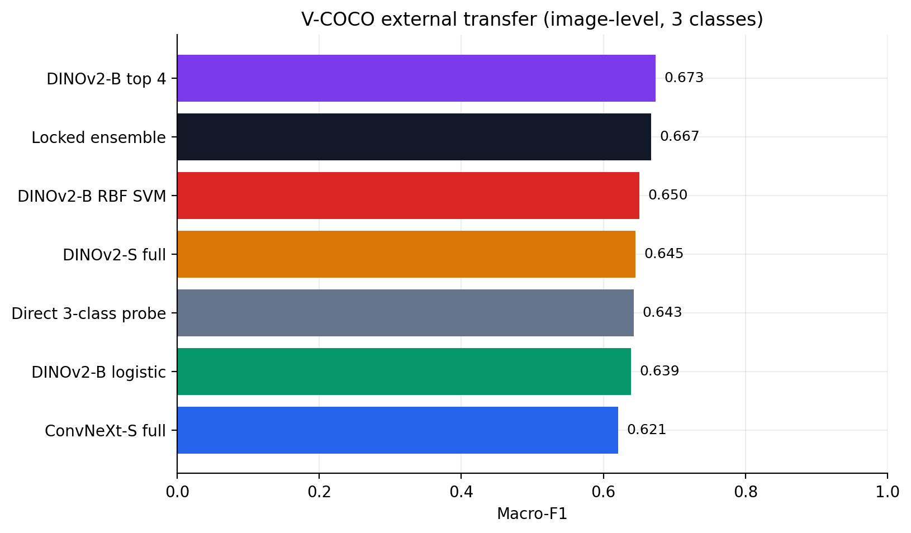

# A 0.94 Macro-F1 System—and the Tests That Made the Result Worth Trusting

It is easy to improve an image classifier when every decision can be reconsidered after
looking at the test set. It is much harder to improve one while preserving a clean
answer to a simple question: *what did the model know before the test was opened?*

This project began as a 285-image activity classifier with a 43-image test split. The
expanded study uses a cleaned four-class subset of POLAR, a one-time test gate,
ConvNeXt and DINOv2 models trained across three seeds, linear and RBF classifiers on
multilayer embeddings, and a locked evaluation on a second dataset.

The final in-domain result is strong: **0.940 macro-F1 and 0.946 accuracy on 3,329 held-out
POLAR images**. The more useful result is the full pattern around that number.

## The first improvement was the data boundary

POLAR provides official train, validation, and test partitions, but byte-level duplicate
checks were not enough. The image audit found alternate crops, color/monochrome
renderings, and nearby frames from the same source across partitions. I combined
perceptual hashing with normalized-pixel correlation and used frozen DINOv2 retrieval
only to propose extra candidates for confirmation.

The audit quarantined 125 images from 61 connected source-related groups before any
supervised fitting. Nothing was moved from test into training. The resulting split held
9,958 training, 3,327 validation, and 3,329 test images.

That step did not make the headline number larger. It made the number interpretable.

## Most of the gain came from scale, representation, and diversity

The cleanest isolated experiment was a frozen DINOv2-B learning curve. Validation
macro-F1 rose from 0.849 with 242 training images to 0.915 with 9,958. The curve stayed
monotonic at 500, 1,000, and 3,000 images.

Regularization mattered, but not in the way a checklist suggests. Dropout and image
augmentation prevented clear regressions. MixUp, label smoothing, inverse-frequency
weights, and removing random erasing did not improve the seed-42 baseline. I kept the
failed interventions in the evidence instead of rewriting the experiment around the
winner.

The final system blends five development-locked components:

- fully adapted ConvNeXt-S;
- fully adapted DINOv2-S;
- DINOv2-B with its top four blocks adapted;
- logistic regression on official DINOv2-B multilayer features;
- a calibrated RBF SVM on the same representation.

The blend reached 0.940 macro-F1. The strongest standalone component, the RBF SVM,
reached 0.927. A 10,000-resample paired bootstrap put the ensemble gain over that SVM at
+0.0125, with a 95% interval of [0.0065, 0.0186]. Every component comparison had a
strictly positive interval.

## The SVM added a small gain at high systems cost

The RBF experiment was worth doing because the DINOv2 representation was already
strong. It answered whether a nonlinear boundary could recover structure that a linear
probe missed.

It could, but only slightly. The RBF SVM reached 0.9274 macro-F1 versus 0.9258 for
multinomial logistic regression. It also took about 60 minutes to fit and serialized to
871 MB. Logistic regression fitted in 14 seconds, occupied 0.4 MB, and produced much
better log loss and ECE.

My engineering conclusion is straightforward: keep the RBF model as a research probe
and diversity component; prefer logistic regression when serving cost and calibration
matter.

## External validation changed the tone of the result

I mapped the locked system to sitting, standing, and walking/running and evaluated it
without retuning on V-COCO. Before inference, a cross-dataset audit compared all 16,614
clean POLAR records with 4,123 V-COCO images. It found no exact or threshold-level
perceptual overlap.

The in-domain collapsed ensemble scored 0.961 macro-F1. On 3,761 unambiguous V-COCO
images, it scored 0.667. Adapted DINOv2-B transferred best at 0.673.

The 29-point gap shows that regularities learned on POLAR transfer only partly to a
different image and annotation distribution. Adapted DINOv2-B also transfers slightly
better than the in-domain-optimal ensemble. Domain generalization is therefore the
highest-value next experiment.

## The external gap had more than one cause

The post-lock analysis changed how I interpret that 29-point gap without changing the
selected system or its score. V-COCO people are smaller: its median person-box area is
roughly half the POLAR median. Performance improves for larger people in both datasets,
but even the largest V-COCO quartile remains well below the in-domain result. Scale is
one contributor, not a complete explanation.

The annotation policies also conflict. V-COCO actions are non-exclusive, and 93.1% of
the people mapped to walking/running also carry a source `stand` action. Under the fixed
exclusive mapping, 82.8% of the ensemble's image-level errors are
standing-to-locomotion. That makes the external result a test of visual and semantic
shift together, rather than a clean replication of the POLAR task.

Confidence does not solve the problem. Confidence-correctness AUROC falls from 0.923
on POLAR to 0.584 on V-COCO, and many external errors are unanimous across all five
components. The models become confidently wrong in the same direction, which is more
important than the small difference between their external point estimates.

## Faithfulness required more than localization

The explanation audit combined four kinds of evidence: deletion/insertion curves,
person-box localization, equal-area person-versus-context occlusion, and parameter
randomization. The cohort contained 256 images balanced by class and person-box size.

ConvNeXt Grad-CAM behaved convincingly. Its targeted deletion curve separated from
random deletion, attribution mass was 2.37 times the uniform-area expectation inside
the person box, and maps changed substantially after target or learned parameters were
randomized.

DINOv2-B integrated gradients looked good if I considered localization alone: 84.8% of
positive attribution mass fell inside person boxes. The harder checks told a different
story. Area-normalized lift was only 1.10, alternative-target maps had Spearman
correlation 0.93, and maps still correlated 0.71 after randomizing the classifier and
adapted transformer blocks.

The DINO maps support coarse person localization. Their high target and parameter
randomization correlations limit the class-specific interpretation of the heatmaps.

## Bit flips answered a different question

Input and classifier-weight bit flips were added as a separate robustness audit, not as
an explanation metric. At the largest tested input rate—0.1% of uint8 input bits—both
neural components retained roughly 98% label agreement with their clean predictions.
Sixteen flips per quantized classifier matrix caused no label changes in the averaged
cohort output.

This experiment measures bounded software fault injection on 256 images. The tested
interventions cover input tensors and classifier matrices.

## What the study contributes

The main contribution is the engineering and evaluation discipline around a strong
benchmark:

- source-aware quarantine before fitting;
- development-only selection and one-time test access;
- multi-seed final fits with artifact lineage;
- a measured SVM-versus-logistic tradeoff;
- paired uncertainty for the ensemble gain;
- external validation that exposes the domain gap;
- attribution tests that are allowed to fail.

The clearest extension is to apply the same locked workflow to the remaining POLAR
actions or an independently collected dataset with subject/session identifiers, then
predeclare a domain-generalization intervention.

The complete methods, tables, limitations, and references are in the
[independent technical report](POLAR_PUBLIC_REPORT.md). Every promoted number is also
available as path-free tracked evidence in `results/`.
