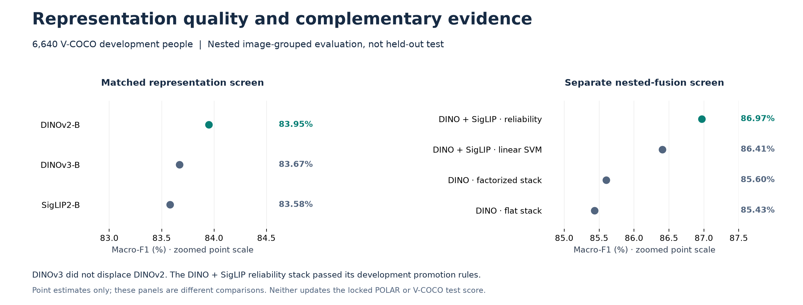

# Representation comparisons

## Current POLAR benchmark

All four frozen families use full-frame plus 10%-context person features, the
same RBF/calibration budget and the same audited rows within each task.
The controls match image membership, view definitions and head-search budget.
Feature layouts and preprocessing are encoder-specific; pretraining data,
parameter counts and FLOPs are not matched.

| Frozen encoder | Four-class macro-F1 | Nine-class macro-F1 |
| --- | ---: | ---: |
| DINOv2-B | 93.09% | 90.89% |
| DINOv3-B | 93.05% | 91.19% |
| SigLIP2-B | 95.19% | 91.92% |
| ConvNeXt V2-B | 87.75% | 84.87% |

[Full metrics](RESULTS.md) ·
[Paired comparisons](research/20260921_final_evaluation/results/comparisons.csv).

DINOv3-B was tested on POLAR. Its nine-class point estimate exceeds frozen DINOv2,
but this does not establish a universal or statistically supported family ranking.
DINOv3-L was unavailable and was not silently substituted.

## Frozen feature contracts

| Encoder | Features per view | Two-view dimension | Resize and crop | Normalization |
| --- | --- | ---: | --- | --- |
| DINOv2-B | Last four normalized CLS tokens + final-layer mean patch token | 7,680 | Short edge 256, center crop 224; bicubic | ImageNet |
| DINOv3-B | Pooled 768-dimensional representation | 1,536 | Resize to 224 × 224; bilinear | ImageNet |
| SigLIP2-B | Attention-pooled 768-dimensional vision representation | 1,536 | Resize to 224 × 224; bilinear | Mean / standard deviation 0.5 in every channel |
| ConvNeXt V2-B | Pooled 1,024-dimensional representation | 2,048 | Short edge 256, center crop 224; bicubic | ImageNet |

Each transform is applied to both declared views before their features are
concatenated. The DINOv2 classifier therefore sees a larger multilayer descriptor,
not a width-matched pooled embedding. Its 7,680-dimensional vector also gives a
different numerical RBF gamma under the common rule gamma = 1/d.
ConvNeXt V2's recorded processor uses `shortest_edge=224` with `crop_pct=0.875`,
which produces the 256-pixel short-edge resize.

Implementation: [model specifications and transforms](../src/hac/polar_benchmark_features.py)
and [DINOv2 feature layout](../src/hac/polar_features.py). The DINOv3 reconstruction
limitation below is part of the evaluated configuration, not a claim of parity
with the provider's default recipe.

## DINOv3 provenance

The transferred DINOv3-B checkpoint was recovered and verified by hash.
Its original processor JSON was absent. The recorded reconstruction used
Transformers 5.5.3 defaults: 224 pixels, bilinear resizing and ImageNet
normalization. This is not provider preprocessing byte parity or the general
256-pixel DINOv3 recipe. Provider access and parameter terms still apply.

The [historical access record](DINOV3_ACCESS.md) describes the earlier V-COCO
screen, not an assertion that all POLAR processor metadata was available.

## Adaptation and complementarity

Nine-class adapted DINOv2 reaches 93.90% test F1, adapted SigLIP2 92.85%, and
conservative fusion with frozen SigLIP2 94.58%. Fusion's paired gain over adapted
DINOv2 is +0.68 pp [0.38, 0.99], Holm p = 0.00180.

On four classes, frozen SigLIP2 reaches 95.19%, adapted SigLIP2 95.23% and the
nominee 95.21%. The nominee does not show a supported gain over frozen SigLIP2.
Complementarity is task-dependent. [Architecture](ARCHITECTURE.md).

## Earlier V-COCO development screen

A separate three-class person-level task: 6,640 development people, nested
image-grouped folds and matched view/classifier budgets.

| Representation | Macro-F1 | Accuracy | Locomotion F1 |
| --- | ---: | ---: | ---: |
| DINOv2-B | 83.95% | 86.36% | 70.06% |
| DINOv3-B | 83.67% | 86.01% | 70.13% |
| SigLIP2-B | 83.58% | 85.63% | 71.72% |

Later DINO + SigLIP factorized reliability fusion reached 86.97% nested development
F1, not a held-out update. DINOv3 did not pass the historical replacement gate.
[Evidence](../results/vcoco_v3/source_tag_promotion_decisions.json) ·
[V-COCO report](VCOCO_V2_EXTERNAL_TRANSFER.md).

## Original methods

- [DINOv2 official implementation and paper](https://github.com/facebookresearch/dinov2).
- [DINOv3 official implementation](https://github.com/facebookresearch/dinov3).
- [SigLIP 2 paper](https://arxiv.org/abs/2502.14786).
- [ConvNeXt V2 official implementation and paper](https://github.com/facebookresearch/ConvNeXt-V2).

These representations are prior work; this project evaluates their behavior
under its documented downstream protocol.
