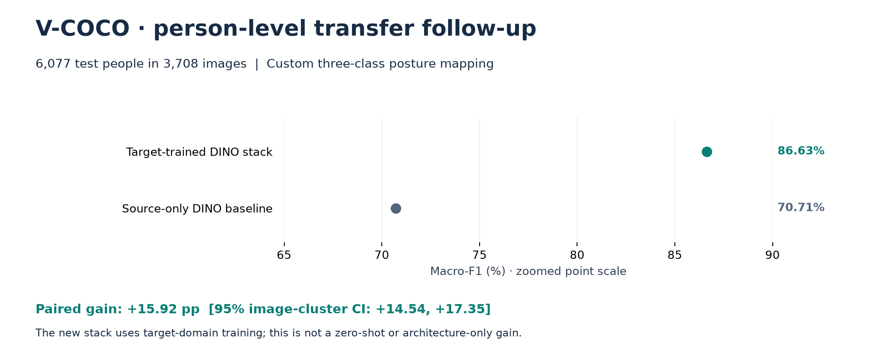

# Results and useful findings

Scores below are grouped by evaluation protocol. They are not a combined leaderboard.
Macro-F1 is the primary measure; differences are percentage points (pp).

## 1. Primary four-class POLAR test

| System | Macro-F1 | Accuracy | 95% macro-F1 interval |
| --- | ---: | ---: | --- |
| **Locked ensemble** | **93.99%** | **94.56%** | **93.12–94.81%** |
| DINOv2-B multilayer + RBF SVM | 92.74% | 93.42% | 91.79–93.62% |
| DINOv2-B multilayer + logistic regression | 92.58% | 93.24% | 91.64–93.43% |
| DINOv2-B top-four-block adaptation | 92.52% | 93.27% | 91.56–93.43% |
| DINOv2-S full adaptation | 91.31% | 92.10% | 90.28–92.26% |
| ConvNeXt-S full adaptation | 89.14% | 89.94% | 88.03–90.20% |

All six systems share the same **3,329 held-out images**. The ensemble's gain over
the strongest standalone component is **+1.25 pp [0.65, 1.86]** under 10,000 paired,
class-stratified bootstrap draws. Its NLL is **0.1564**, summed multiclass Brier
**0.0838**, and ECE **0.0291**. Uncertainty covers finite test-sample variation,
not all possible training seeds or undetected source overlap.
[Metrics](../results/polar_test_metrics.csv),
[uncertainty](../results/polar_test_uncertainty.json).

## 2. Useful secondary and development results

| Finding | Result | Boundary |
| --- | --- | --- |
| Collapse walking/running after inference | **96.11% macro-F1 / 96.22% accuracy** | Secondary three-class task on the same test rows; not the primary four-class score |
| Direct three-class frozen probe | **95.31% macro-F1 / 95.43% accuracy** | Separate declared secondary system |
| Selected validation blend | **94.65% macro-F1** | Development selection, not held-out performance |
| Frozen DINOv2-B learning curve | **84.87% → 91.50%** | 242 → 9,958 training images; same validation set |

The learning-curve subsets are deterministic and nested. Repeated seed rows at the
same size are not independent subset replications. Sources:
[secondary task](../results/polar_test_secondary_metrics.csv),
[development and scale](../results/polar_extension_summary.json).

## 3. V-COCO person-level held-out follow-up

| System | Macro-F1 | Accuracy |
| --- | ---: | ---: |
| Source-only historical DINO baseline | 70.71% | 70.10% |
| **Target-trained scale-conditioned DINO stack** | **86.63%** | **87.95%** |

Evaluation uses **6,077 people in 3,708 images** from the official test membership,
with a custom sitting / standing / walking-running mapping. The gain is
**+15.92 pp [14.54, 17.35]**, using image-cluster bootstrap uncertainty.
ECE falls from **0.2288 to 0.0076**. This comparison includes target supervision,
preprocessing and stack changes; it is not a pure architecture or zero-shot gain.
[Metrics](../results/vcoco_v2/official_test_metrics.csv),
[paired interval](../results/vcoco_v2/official_test_uncertainty.json).

Matched development controls provide narrower evidence:

| Comparison | Macro-F1 change; 95% image-cluster interval |
| --- | ---: |
| Selected multiview stack minus best single-view DINO | **+1.18 pp [0.37, 2.01]** |
| Factorized minus flat head, same features | **+1.11 pp [0.56, 1.66]** |

The multiview comparison changes a combined system, not only its crop. The factorized
comparison more directly supports separating posture from locomotion.
[Locked development comparisons](../results/vcoco_v2/final_selection_lock.json).
The full report retains aspect-ratio, augmentation, scale and selective-risk analyses,
including competitive alternatives that did not pass promotion.
[V-COCO report](VCOCO_V2_EXTERNAL_TRANSFER.md).

## 4. DINOv3, SigLIP2 and later nested fusion

The matched representation screen uses **6,640 V-COCO development people**, nested
image-grouped folds and matched view/classifier budgets. It is not a test-set ranking.

| Representation | Macro-F1 | Accuracy | Locomotion F1 |
| --- | ---: | ---: | ---: |
| **DINOv2-B** | **83.95%** | **86.36%** | 70.06% |
| DINOv3-B | 83.67% | 86.01% | 70.13% |
| SigLIP2-B | 83.58% | 85.63% | **71.72%** |

DINOv3 did not improve macro-F1 or pass either promotion rule. SigLIP2's higher
locomotion point estimate did not pass the specialist gate. Neither replaces DINOv2.
Its complementary information nevertheless helped a **separately evaluated** fusion:

| Nested fusion system | Macro-F1 | Accuracy |
| --- | ---: | ---: |
| DINO flat probability stack | 85.43% | 87.47% |
| DINO factorized probability stack | 85.60% | 87.62% |
| DINO + SigLIP linear-SVM control | 86.41% | 88.27% |
| **DINO + SigLIP factorized reliability stack** | **86.97%** | **88.70%** |

The reliability stack passed the recorded nested-development promotion rules;
its Holm-adjusted macro and locomotion p-values were both approximately 0.00060.
This is not a new held-out score or an update of the earlier locked test result.
[Source metrics](../results/vcoco_v3/source_tag_development_metrics.csv),
[promotion decisions](../results/vcoco_v3/source_tag_promotion_decisions.json),
[implementation and access](REPRESENTATIONS.md).

## 5. Interpretation and coverage

The full [POLAR report](POLAR_PUBLIC_REPORT.md) also preserves attribution sanity,
robustness, calibration, scene composition and source-only external transfer.
ConvNeXt attribution checks and bounded fault tests are diagnostics, not evidence
of general safety. DINOv2 attribution sanity failures and domain-shift regressions
remain in the report. Annotation-derived pose or support oracles are not deployable
classifiers and are not included among the achieved-model headlines.

The earlier [COCO pilot](LEGACY_COCO_STUDY.md) used a much smaller sample and remains
historical. Temporal confirmation, budgeted inference and ARFTR architecture results
are presented in the [companion architecture project](https://github.com/abdullahuseyinli-dot/arftr/blob/main/docs/RESULTS.md).
