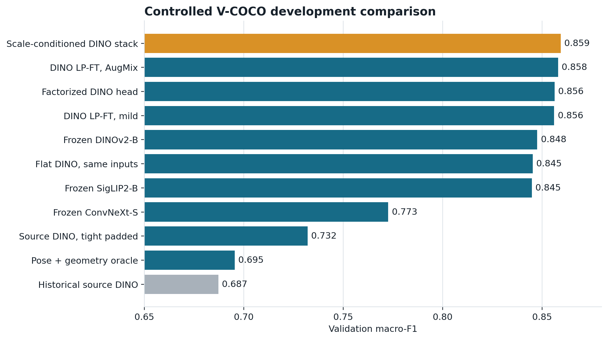
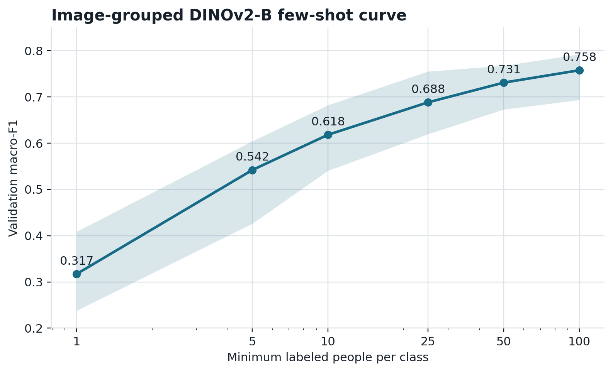

<!-- toc -->

## Abstract

The original POLAR study reached 0.961 three-class macro-F1 in-domain but transferred
to V-COCO at 0.667 image-level and 0.684 person-level macro-F1. This follow-up isolates
the source of that gap under a split-preserving V-COCO protocol. The study controls the
person crop, context width, aspect-ratio handling, representation, classifier,
factorized posture and motion targets, partial fine-tuning, augmentation, background
interventions, and person-box geometry. All choices were made on the official training
and validation splits. The selected system and evaluation code were hash-locked before
the official test labels were opened once.

The selected scale-conditioned stack combines DINOv2-B probabilities from a tight
person view and a 25% context view with five geometry features. It reached 0.8594
validation macro-F1 and 0.8663 official-test macro-F1. On the same 6,077 test people,
the historical source-only DINO system reached 0.7071. The paired improvement was
+0.1592 macro-F1 with a 95% image-cluster bootstrap interval of [+0.1454, +0.1735].
Accuracy improved from 0.7010 to 0.8795, log loss fell from 1.6525 to 0.2902, and
expected calibration error fell from 0.2288 to 0.0076. The largest test gains occurred
for short and small-box people. A factorized posture-motion classifier improved over a
flat classifier using exactly the same inputs by +0.0111 validation macro-F1, while
AugMix and top-block fine-tuning were statistically tied with the frozen multiview
stack. These results identify person scale, view construction, and label structure as
the main recoverable components of the original transfer gap.

## 1. Research questions

The experiments answer five questions:

1. How much of the external gap comes from showing the model the wrong spatial view?
2. Does a modern frozen representation transfer better than a fully adapted source
   classifier?
3. Does the non-exclusive structure of V-COCO actions benefit from a posture-motion
   factorization?
4. Do partial fine-tuning and stronger augmentation add reliable value beyond the
   frozen representation?
5. Do improvements hold on the untouched official test split, including small people,
   crowded images, and person boxes that touch an image boundary?

The endpoint is three-class person-level classification: sitting, standing, and
walking/running. V-COCO's original endpoint is visual semantic role labeling, so its
role average precision is a different measurement. Comparisons in this report use one
fixed person-level mapping and one locked split protocol.

## 2. Data and protocol

### 2.1 Split construction

V-COCO provides person-centric action annotations over COCO images. The study keeps the
official train, validation, and test memberships. A deterministic action-tag mapping
creates the three target classes while preserving posture, motion, gait, and source
co-tags in separate columns. People with incompatible sitting and standing tags are
kept visible in the audit and excluded from the mutually exclusive endpoint.

| Split | People | Source images | Sitting | Standing | Walking/running |
| --- | ---: | ---: | ---: | ---: | ---: |
| Train | 3,090 | 1,924 | 923 | 1,576 | 591 |
| Validation | 3,550 | 2,199 | 1,049 | 1,831 | 670 |
| Official test | 6,077 | 3,708 | 1,882 | 2,962 | 1,233 |

The cross-dataset audit found no confirmed source-related pair between the cleaned
POLAR data and the retained V-COCO development or test images. Sixty test images that
overlapped the legacy external evaluation were quarantined before model fitting. The
resulting protocol lock has SHA-256 digest
`3a90d6720a6cf5250b995820801199eca611706d514e7b5de2c83bea03f5a143`.

### 2.2 Selection and test access

Models were fitted on the official training split and selected on validation. After
selection, the fixed stack was refitted on all 6,640 development people in 4,123
images. Base learners were cross-fitted by source image so that the stacker saw
out-of-fold base predictions. The selected artifact, inference dependencies, metric
code, historical checkpoints, and development evidence were bound into selection lock
`4c0d13c05d537e28066000092e88c37f66b937111516715c8f1756cab162e10d`.

The test feature pass read image and box metadata without reading a label column. The
evaluation stage then opened the official test labels once, evaluated the selected
stack and the historical baseline, and wrote a persistent access gate. No test result
was used for model choice, thresholding, calibration, class weighting, or blending.

### 2.3 Metrics and uncertainty

Macro-F1 is the primary metric. Secondary metrics are accuracy, balanced accuracy,
weighted F1, multiclass log loss, Brier score, fixed-bin ECE, adaptive ECE, classwise
ECE, class-level precision/recall/F1, confusion matrices, and risk-coverage area. The
paired confidence interval resamples 3,708 source images and retains every annotated
person belonging to each sampled image. The confirmatory rule required at least +0.01
macro-F1 and a 95% paired interval above zero.

## 3. Methods

### 3.1 Historical source-only baseline

The baseline is the three-seed mean of the original POLAR DINOv2-B classifier with its
top four transformer blocks adapted. Its four-class probabilities are collapsed by
summing walking and running. The original 25% context crop and center-crop preprocessing
are replayed exactly; validation probabilities match the earlier artifact to numerical
precision.

### 3.2 Person views and preprocessing

Five deterministic views were studied: full frame, tight person box, and person boxes
with 10%, 25%, or 50% context. Aspect-preserving evaluation pads the crop to a square
before bicubic resizing to 224 pixels. This retains the whole person and avoids the
limb truncation introduced by resizing followed by a center crop.

Two background interventions keep the person pixels unchanged while either blurring
or masking the background inside the 25% context crop. They distinguish useful person
scale from useful background content.

### 3.3 Representations and classifiers

The controlled screen uses revision-pinned frozen features from DINOv2-B, ConvNeXt-S,
and SigLIP2-B. Logistic regression and calibrated linear SVMs are compared with and
without class weighting and with visual-only or visual-plus-geometry inputs. The five
geometry variables are log box area, log aspect ratio, normalized box center x and y,
and log person height. Every cross-validation fold groups people by source image.

The selected base learners are unweighted multinomial logistic regressions with
`C=0.01`, fitted separately to tight and 25%-context DINOv2-B features. Their
cross-fitted log probabilities and the five geometry variables feed an unweighted
multinomial stacker with `C=1.0`.

### 3.4 Factorized posture and motion

The flat three-class target is decomposed into seated versus upright posture and,
conditional on upright posture, stationary versus locomoting motion. The decoder
reconstructs sitting, standing, and walking/running probabilities. A matched flat
classifier uses the same tight feature, context feature, and geometry inputs, making
the factorization comparison controlled.

### 3.5 Partial fine-tuning and augmentation

Neural adaptation follows a linear-probe-then-fine-tune schedule. A frozen DINOv2-B
probe is trained first, its exact checkpoint initializes the next stage, and only the
top transformer block and classifier are updated. Dropout is 0.10. The person-safe
mild policy uses horizontal flips, small affine changes, restrained color jitter,
low-amplitude Gaussian noise, and small random erasing after square padding. The
AugMix variant adds severity-2 AugMix while retaining the same bounded geometry and
erasing policy. Training stops from validation performance under the locked epoch
budget.

### 3.6 Diagnostic controls

Ground-truth COCO keypoints plus geometry feed a calibrated RBF SVM as a pose oracle.
Because the keypoints come from the target annotation source, this is a diagnostic
upper-information control rather than a deployment candidate. Few-shot curves sample
complete source-image groups for per-class label budgets of 1, 5, 10, 25, 50, and 100,
with 20 deterministic repeats per budget.

## 4. Development results

| Candidate | Validation macro-F1 | Accuracy | Log loss | Role |
| --- | ---: | ---: | ---: | --- |
| Scale-conditioned DINO stack | **0.8594** | **0.8777** | **0.2983** | Selected |
| DINO LP-FT, AugMix | 0.8580 | 0.8752 | 0.3251 | Neural adaptation |
| DINO LP-FT, mild | 0.8561 | 0.8718 | 0.3284 | Neural adaptation |
| Factorized DINO head | 0.8563 | 0.8758 | 0.3096 | Structured target |
| Frozen DINO, tight view | 0.8476 | 0.8696 | 0.3149 | Best single view |
| Frozen SigLIP2 | 0.8449 | 0.8662 | 0.3311 | Representation control |
| Frozen ConvNeXt | 0.7726 | 0.7834 | 0.5153 | Representation control |
| Source DINO, tight padded view | 0.7321 | 0.7285 | 1.4882 | Source-only weights |
| COCO pose and geometry oracle | 0.6954 | 0.7166 | 0.6278 | Diagnostic |
| Historical source DINO | 0.6872 | 0.6780 | 1.8448 | Baseline |

The stack improved over the historical validation baseline by +0.1722 macro-F1, with
a 95% image-cluster interval of [+0.1538, +0.1907]. It also improved over the best
single-view DINO control by +0.0118, interval [+0.0037, +0.0201], satisfying the
predeclared promotion rule.

The factorized head reached 0.8563 versus 0.8453 for the flat classifier with the same
inputs. The paired difference was +0.0111, interval [+0.0056, +0.0166]. This isolates a
benefit from target structure rather than backbone, crop, or feature differences.

AugMix improved over mild partial fine-tuning by +0.0020, but its interval
[-0.0036, +0.0075] included zero. The stack and AugMix model were likewise tied:
+0.0014, interval [-0.0075, +0.0102]. Additional neural seeds were not promoted because
the observed margin was below the +0.01 rule.

### 4.1 Few-shot behavior

| People per class | Mean macro-F1 | Standard deviation |
| ---: | ---: | ---: |
| 1 | 0.3170 | 0.0768 |
| 5 | 0.5419 | 0.0555 |
| 10 | 0.6181 | 0.0407 |
| 25 | 0.6882 | 0.0434 |
| 50 | 0.7308 | 0.0298 |
| 100 | 0.7575 | 0.0275 |

The first 25 labels per class recover the historical source-only validation result on
average. Performance continues to rise through 100 labels per class, so the remaining
gap is not exhausted by the measured few-shot range.

## 5. Official test results

| Method | Macro-F1 | Accuracy | Balanced accuracy | Log loss | ECE | AURC |
| --- | ---: | ---: | ---: | ---: | ---: | ---: |
| Scale-conditioned DINO stack | **0.8663** | **0.8795** | **0.8636** | **0.2902** | **0.0076** | **0.0296** |
| Historical source DINO | 0.7071 | 0.7010 | 0.7674 | 1.6525 | 0.2288 | 0.2007 |

The paired macro-F1 gain is +0.1592, with a 95% interval of [+0.1454, +0.1735]. The
confirmatory rule passed. Validation and test macro-F1 differ by only +0.0069, while
test log loss is slightly lower, showing that the locked choice generalized without a
drop at the final gate.

### 5.1 Per-class behavior

| Class | Stack precision | Stack recall | Stack F1 | Baseline F1 | F1 change |
| --- | ---: | ---: | ---: | ---: | ---: |
| Sitting | 0.9438 | 0.9554 | 0.9496 | 0.9033 | +0.0462 |
| Standing | 0.8731 | 0.8852 | 0.8791 | 0.6209 | +0.2582 |
| Walking/running | 0.7913 | 0.7502 | 0.7702 | 0.5970 | +0.1732 |

The historical classifier predicts walking/running for 1,355 standing people. The
stack reduces that error to 236. It makes the opposite error for 305 locomoting people,
up from 98 in the baseline, so the remaining boundary is asymmetric: locomotion recall
is the principal class-level opportunity.

### 5.2 Calibration and selective prediction

The stack's ECE is 0.0076, adaptive ECE is 0.0104, and classwise ECE is 0.0098. At 90%
coverage it retains 5,470 people, reaches 0.9163 accuracy and 0.9011 macro-F1, and has
8.37% risk. At 70% coverage, accuracy reaches 0.9605 and macro-F1 0.9459. The full
risk-coverage area falls from 0.2007 for the baseline to 0.0296 for the stack.

## 6. What explains the gain

### 6.1 Person scale is the strongest measured mechanism

The improvement is largest where the historical system is weakest.

| Test stratum | Stack macro-F1 | Baseline macro-F1 | Gain |
| --- | ---: | ---: | ---: |
| Smallest box-area quartile | 0.8870 | 0.6668 | +0.2202 |
| Area quartile 2 | 0.8656 | 0.6782 | +0.1874 |
| Area quartile 3 | 0.8485 | 0.7177 | +0.1308 |
| Largest box-area quartile | 0.8535 | 0.7597 | +0.0938 |
| Shortest-person quartile | 0.8820 | 0.6495 | +0.2325 |
| Tallest-person quartile | 0.8291 | 0.7455 | +0.0836 |

On validation, the correlation between correctness and person height falls from
Spearman 0.1503 for the historical model to 0.0061 for the stack; the corresponding
box-area correlation falls from 0.1679 to 0.0320. The scale-conditioned system is not
merely better on average: it removes most of the historical dependence on how large a
person appears.

### 6.2 Crop construction matters before weight adaptation

Applying a tight, aspect-preserving person view to unchanged source weights raises
validation macro-F1 from 0.6872 to 0.7321, a paired gain of +0.0449 with interval
[+0.0343, +0.0557]. Frozen target-trained DINO features then reach 0.8476. The
background-mask and background-blur controls remain around 0.843, offering no
improvement over the ordinary context view. The useful intervention is therefore the
person's scale and complete geometry, not removal of the scene.

### 6.3 Representation dominates the conventional ConvNet control

Under matched person-centric preprocessing and target training, frozen DINOv2-B
reaches 0.8476 validation macro-F1 and ConvNeXt-S reaches 0.7726. SigLIP2-B reaches
0.8449 and is statistically tied with DINOv2-B in the paired comparison. DINOv2-B is
selected because it combines the best point result with a simpler vision-only feature
path and strong multiview complementarity.

### 6.4 Structure and geometry help in combination

The pose oracle reaches only 0.6954, while the visual-plus-geometry DINO models exceed
0.84. Geometry alone does not solve the task. It becomes useful as a conditioning
signal for reconciling tight and contextual visual evidence. Separately, the matched
factorized comparison shows that encoding seated/upright and stationary/locomoting
structure improves the decision rule even when every input feature is fixed.

### 6.5 Partial fine-tuning has limited marginal value here

LP-FT with person-safe AugMix reaches 0.8580, within the uncertainty interval of the
0.8594 frozen stack. This supports a practical conclusion for this data regime:
high-quality person-centric DINO features plus a controlled classifier capture nearly
all of the measured benefit, while top-block tuning increases training cost without a
reliable accuracy margin.

## 7. Engineering controls

- DINOv2 and SigLIP2 model revisions are pinned rather than resolved from a moving
  default branch.
- Cross-validation, bootstrapping, and few-shot sampling use fixed seeds.
- People from one source image remain together in cross-validation and uncertainty
  resampling.
- Every experiment checks the protocol hash and records zero official-test rows read
  during development.
- The final stack refit reproduces the selected validation probabilities with maximum
  absolute difference 0.0 before using all development rows.
- The label-free test feature artifacts are hash-checked before evaluation.
- The official-test evaluator is idempotent and rejects a changed cached manifest,
  selection lock, feature artifact, checkpoint, or implementation source.
- Portable evidence is generated by one exporter and inventoried with SHA-256 hashes.

The repository's lint, unit-test, and evidence validators pass against the exported
package. The test gate and portable evidence are checked again during release
validation.

## 8. Scope and remaining questions

The results establish a reproducible person-level endpoint under this action-tag
mapping. Three extensions would add the most scientific value:

1. Independently relabel a balanced sample of sitting, standing, walking, and running
   from pixels, with adjudication and inter-rater agreement. This would separate model
   error from source-tag semantics.
2. Add a temporal dataset. Still images cannot resolve motion when pose and context are
   visually compatible with both standing and locomotion.
3. Repeat the locked protocol on another person-centric dataset with different image
   sources. That would test whether the scale-conditioned gain transfers beyond COCO
   imagery.

The controlled representation screen was limited to the revision-pinned DINOv2-B,
ConvNeXt-S, and SigLIP2-B checkpoints declared in the protocol.

## 9. Reproduction map

The compact evidence lives under `results/vcoco_v2/`. The core sequence is:

1. `tools/build_vcoco_v2_manifests.py` builds the factorized split manifests.
2. `tools/lock_vcoco_v2_protocol.py` fixes the endpoint and test policy.
3. `experiments/cache_vcoco_v2_features.py` extracts revision-pinned development
   features.
4. The screen, few-shot, factorized, neural, background, and mechanism scripts produce
   development evidence.
5. `experiments/fit_vcoco_v2_final_stack.py` verifies selection replay and refits all
   development rows.
6. `tools/lock_vcoco_v2_final_selection.py` binds the champion and evaluation sources.
7. `experiments/cache_vcoco_v2_final_test_features.py` performs label-free test feature
   extraction.
8. `experiments/evaluate_vcoco_v2_final_test.py` opens the test labels once and writes
   the final evidence.
9. `tools/export_vcoco_v2_results.py` creates the portable package.

Run `python -m ruff check .`, `python -m pytest`, and
`python tools/validate_repository.py` before committing a release.

## 10. Conclusion

The original external gap was largely recoverable without a new backbone. The largest
improvement came from treating the person instance, its scale, and its local context as
first-class inputs. A structured classifier added a smaller but independently supported
gain. Partial fine-tuning and stronger augmentation remained competitive but did not
beat the frozen stack by the locked margin. On the official test set, the final system
improved macro-F1 by 15.9 points, removed most of the historical small-person penalty,
and produced calibrated confidence that supports useful abstention.

## References

1. S. Gupta and J. Malik. [Visual Semantic Role Labeling](https://arxiv.org/abs/1505.04474), 2015.
2. M. Oquab et al. [DINOv2: Learning Robust Visual Features without Supervision](https://arxiv.org/abs/2304.07193), 2023.
3. Z. Liu et al. [A ConvNet for the 2020s](https://arxiv.org/abs/2201.03545), CVPR 2022.
4. M. Tschannen et al. [SigLIP 2: Multilingual Vision-Language Encoders with Improved Semantic Understanding, Localization, and Dense Features](https://arxiv.org/abs/2502.14786), 2025.
5. A. Kumar et al. [Fine-Tuning can Distort Pretrained Features and Underperform Out-of-Distribution](https://arxiv.org/abs/2202.10054), ICLR 2022.
6. D. Hendrycks et al. [AugMix: A Simple Data Processing Method to Improve Robustness and Uncertainty](https://arxiv.org/abs/1912.02781), 2020.
