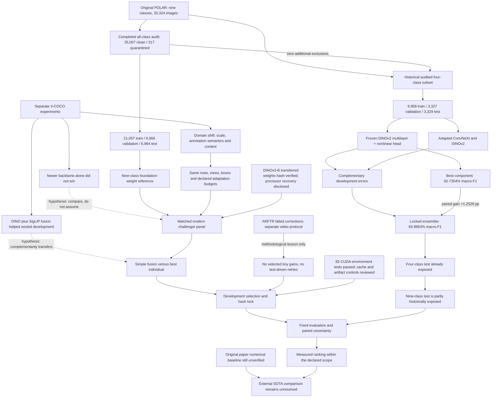

# Evidence-to-experiment map

Date: 2026-09-20. Solid relationships below are backed by the linked artifacts;
proposed runs and cross-domain extrapolations are marked as hypotheses. See
[evidence and comparators](EVIDENCE_AND_COMPARATORS.md) for numbers, qualifications
and sources, and [machine-readable graph](knowledge_graph.json) for typed edges.

The immediate move is **audited nine-class reference plus a bounded modern
challenger panel**, with reusable CUDA features and separate four-class heads.
This tests whether the proven head/fusion engineering remains competitive and
builds a credible nine-class baseline. It does not assume that nine labels are
easier than four, or that a new model name guarantees an improvement.

The nine-class audit found no additional exclusions in the retained four-class
cohort. Its known source groups do not establish subject/session independence;
all-nine-class embedding retrieval remains unperformed. Every completed training
run must produce a passing selected-checkpoint replay receipt. These engineering
checks are not new model scores, and the original paper's numerical baseline
remains unverified.

DINOv3-B's verified local foundation weights remove its access blocker. The
missing original processor file is recovered through a declared pinned 224-pixel
processor recipe, not represented as original processor-byte parity; this does
not establish DINOv3-L availability.
