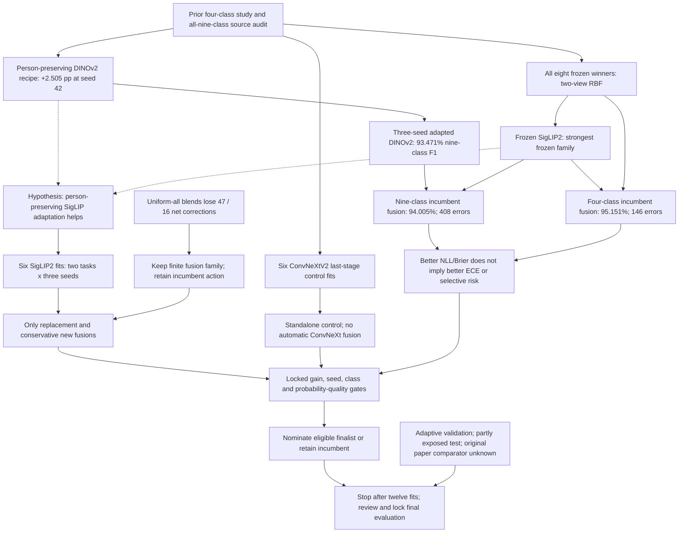

# Completed evidence to bounded next move

Date: 2026-09-21. See [evidence review](EVIDENCE_REVIEW.md),
[machine-readable graph](knowledge_graph.json), and the
[parent graph](../20260920_polar_benchmark/knowledge_graph.json). Scores below are
selected **validation** results; no new test score is claimed.

The conservative fusion keeps the old DINO anchor at 50%, frozen SigLIP2 at 25%
and adapted SigLIP2 at 25%. It tests adaptation without discarding all the frozen
information that created the current nine-class gain. If no candidate passes the
predeclared gates, the correct outcome is to retain the incumbent and finish the
fixed comparison, not start another validation sweep.
