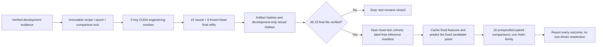

# Locked final POLAR evaluation

Protocol dated 21 September 2026. This phase completes evaluation; it does not
start another development search. New final test scores are not available at
protocol creation. The retained public evidence remains unchanged.

## Fixed nomination

Both tasks nominate **conservative fusion**, selected only using the audited
development validation partition. All components produce probabilities:

`0.50 × DINO anchor + 0.25 × frozen SigLIP2 + 0.25 × adapted SigLIP2`

The nine-class anchor is the mean of three person-preserving adapted DINOv2-B
models. The four-class anchor is the frozen DINOv2-B calibrated RBF. Adapted
SigLIP2 is a three-seed mean; frozen classifiers concatenate full-image and
10%-context annotated-person embeddings.

| Task | Prior validation macro-F1 | Nominated validation macro-F1 | Rescued / harmed | Net fewer errors |
|---|---:|---:|---:|---:|
| Nine classes | 94.0045% | 94.2854% | 41 / 21 | 20 |
| Four classes | 95.1507% | 95.5815% | 28 / 14 | 14 |

Evidence: `.runs/bounded_adaptation_20260921_0406/bounded_summary.json` and
the hash-bound validation predictions below that run. These are selected
development results, not final test performance or proof of superiority.

## Final refits

Use all audited original train+validation rows: **28,023** for nine classes,
**13,285** for four classes. No test examples enter fitting, calibration,
epoch selection, or preprocessing estimation.

| Task | Adapted model | Development best epochs, seeds 42 / 52 / 62 | Fixed final epochs | Fits |
|---|---|---|---:|---:|
| Nine | DINOv2-B | 19 / 16 / 16 | 16 | 3 |
| Nine | SigLIP2-B | 6 / 10 / 10 | 10 | 3 |
| Nine | ConvNeXt V2-B | 18 / 19 / 18 | 18 | 3 |
| Four | SigLIP2-B | 4 / 10 / 13 | 10 | 3 |
| Four | ConvNeXt V2-B | 15 / 10 / 19 | 15 | 3 |

The median-best-epoch rule is frozen before final fitting. Every neural fit
starts from the original pinned foundation checkpoint, not a development fit.
The original **20-epoch learning-rate schedule horizon** is preserved; training
stops at the fixed epoch budget without early stopping or validation selection.
This preserves the development schedule shape rather than silently compressing it.

Neural settings: CUDA bfloat16, batch 16, accumulation 4, AdamW, classifier LR
0.001, backbone LR 0.000005, weight decay 0.0001, warmup fraction 0.1,
dropout 0.1, gradient clipping 1, unweighted cross entropy, no label smoothing
or mixup. Preserve the person-safe mild transform and 25%-context person view.
Use the original encoder-specific normalization. DINOv2's historical adaptation
scope includes its final four blocks **and all backbone normalization layers**;
this is not described as a strict last-four-block-only freeze.

Eight frozen-head refits cover DINOv2-B, SigLIP2-B, DINOv3-B and ConvNeXt V2-B,
each on both tasks. Preserve the actually selected head: **unweighted** RBF SVC,
C=10, gamma=1/feature-dimension, five shuffled source-grouped calibration folds
(seed 42), sigmoid calibration with ensemble averaging. Each scaler is fit
inside its calibration training fold. CUDA computes FP32 kernels with TF32
disabled; libsvm optimization runs on CPU. These are not entirely GPU SVM fits.

## Evidence and access order

Final evaluation cohorts contain **6,984 nine-class** and **3,329 four-class**
examples. The four-class membership is identical to the original reported
test cohort. Its probabilities are recovered from the continuation archive,
verified against original SHA-256
`0f96ecb7411abf8b3385004380a5fa001965113f0855015db4337fb76078c5f9`,
aligned by image ID and class mapping, and required to reproduce 93.988332859%
macro-F1. Historical predictions are not retrained or replaced.

The input to inference is pixels plus the annotated target box. Test feature
extraction cannot accept labels, source groups, or other annotation fields.
Labels are joined only for the sealed reporting/comparison stage. Source groups
are used for statistical uncertainty, not inference.

Important: the four-class test was historically inspected, and nine-class test
membership includes that subset. This is a newly locked evaluation phase,
**not a wholly unseen, independently blinded benchmark**. Source groups identify
detected source overlap; they do not prove subject/session/scene independence.
The audited nine-class split also excludes source-overlap components and is not
the identical unfiltered original-paper protocol. Foundation pretraining overlap
is unknown. DINOv3's local processor reconstruction limitation remains disclosed.

## Candidate family and statistical rules

Each task has ten fixed comparison candidates: conservative fusion, prior
incumbent, replacement fusion, four frozen encoders, adapted SigLIP2 and adapted
ConvNeXt V2. The tenth is adapted DINOv2 for nine classes and the historical
ensemble for four classes. ConvNeXt and replacement fusion remain controls,
not development-approved replacements.

Compare the nominee against each of the other nine candidates in each task:
**18 comparisons in one Holm family**. Five primary contrasts are declared:
nominee versus prior incumbent on each task; versus development-strongest
standalone (adapted DINOv2 for nine, frozen SigLIP2 for four); and versus the
historical four-class ensemble. All remaining contrasts are secondary, still
included in the same correction family. Do not choose a new test winner.

Metrics: macro-F1 (primary), accuracy, per-class precision/recall/F1, confusion,
NLL, Brier, ECE, error overlap and rescue/harm counts. Use 5,000 paired bootstrap
draws for both class-stratified rows and detected-source clusters; seed 20260921.
Use 10,000 two-sided source-group paired prediction swaps with +1 Monte Carlo
correction. Reject/count missing-class cluster draws explicitly. Report raw and
Holm-adjusted p-values, uncertainty, and matching-seed diagnostics. Bootstrap
intervals are pointwise and do not undo historical benchmark exposure.

For adoption relative to the prior incumbent, require **all** of:

- Positive macro-F1 gain and positive net corrections.
- Source-group paired macro-F1 interval lower bound above zero.
- Holm-adjusted paired randomization p-value below 0.05.
- No class loses more than 1 macro-F1 percentage point in its own class F1.
- NLL increase at most 0.02 and Brier increase at most 0.01.
- Positive macro-F1 and net corrections in each matching-seed counterpart.

There are no outer test folds in this official-partition protocol; seeds are
not misrepresented as folds. A failed adoption gate still yields a valid
reported test result. Passing the incumbent gate alone is not superiority over
every comparator and is not an external state-of-the-art claim.

## Operation and completion

New code is isolated in `polar_locked_*` modules and CLI scripts. Source files,
development evidence, data manifests, final checkpoints, probabilities and
analysis outputs are hash-bound. Historical results, figures and documents are
checked for preservation. No retry/threshold/architecture search is permitted
after test access. Failures stop the queue; no silent CPU or missing-model
substitution is allowed. Run one GPU job at a time on the 12 GB device.

The unattended queue has **32 finite jobs**: five tiny engineering smokes,
23 final refits, one fit barrier/test gate, one feature-extraction job, one
prediction job and one statistics/report job. Each job has a 12-hour safety
ceiling, not an expected runtime. Development timings suggest several hours
for the complete queue; startup is verified, then long fitting is left unattended.

Final artifacts reside beneath a new `.runs/final_evaluation_20260921_*/`
directory: `final_selection_lock.json`, `queue_status.json`, `queue_receipts.json`,
`final_fits_verified.json`, `test_access_gate.json`, `evaluation/`, `comparisons/`
and, only on full completion, `completion.json`.

`comparisons/report.md` is the generated final report, with numeric tables,
confidence intervals, correction accounting, nominee confusion plots and
comparison plots. Existing public results are not automatically overwritten.
See [comparison scope](COMPARISON_SCOPE.md) for external evidence boundaries.
