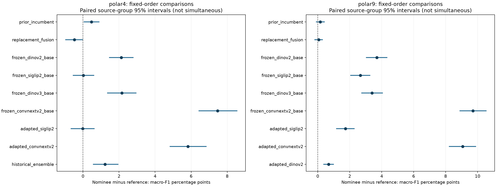
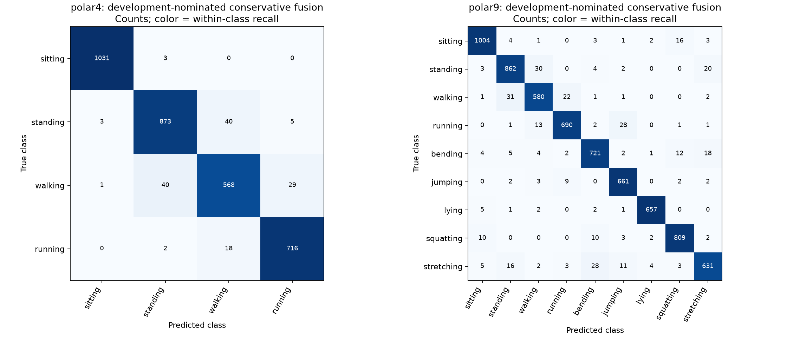

# Locked final evaluation: completed results

**Completed 21 September 2026 at 23:43 Europe/London.** All 32 queue jobs
completed: five engineering checks, 23 final refits, the fit-verification gate,
eight feature caches, both fixed prediction panels and all 18 paired comparisons.
No training or evaluation process remains running. The engineering recoveries
did not change model selection, training settings or comparison gates.

## Nominated model versus its immediate prior

These are measured final-test scores for the development-nominated conservative
fusion, not a newly selected test winner. Four-class and nine-class results use
different class sets and cohorts.

| Task | Test rows | Prior macro-F1 | Nominee macro-F1 | Gain (pp) | Nominee accuracy | Errors | Promotion gate |
| --- | ---: | ---: | ---: | ---: | ---: | ---: | --- |
| Four classes | 3,329 | 94.746153% | 95.211019% | +0.464867 | 95.764494% | 141 | Not passed |
| Nine classes | 6,984 | 94.425294% | 94.583075% | +0.157780 | 94.716495% | 369 | Not passed |

The final bounded adaptation gives small positive point estimates, not a
confirmed improvement over the immediate prior under the complete locked rules:

- **Four classes:** 27 rescues / 13 harms, net 14 fewer errors. Paired
  source-group 95% F1-delta interval **[+0.064, +0.890] pp**, but global
  Holm-adjusted **p = 0.19858** fails the required 0.05 threshold.
- **Nine classes:** 44 rescues / 33 harms, net 11 fewer errors. Interval
  **[-0.091, +0.408] pp** includes zero and Holm-adjusted **p = 0.90831**.
- Every matching-seed pair has positive F1 and net corrections on both tasks.
  Per-class safety, NLL and Brier checks pass. Those findings do not override
  the failed statistical gates or constitute independent test replications.

**Decision: retain the prior incumbents under the prespecified promotion rule.**
Keep the evaluated nominees and all diagnostic candidates as archived results;
do not alter thresholds, reduce the comparison family or select a different
model using these test scores. No public model/result was automatically replaced.

## What is established against other fixed references

The four-class nominee improves over the historical 93.988333% ensemble by
**+1.222686 pp**, with 75 rescues / 35 harms (40 fewer errors), source-group
interval **[+0.573, +1.940] pp** and Holm **p = 0.00420**. This is a supported
paired improvement on the same historically inspected cohort, distinct from
the failed promotion comparison against the newer immediate prior.

The nine-class nominee improves over the adapted DINOv2 standalone by
**+0.678874 pp**, with 80 rescues / 33 harms (47 fewer errors), interval
**[+0.381, +0.987] pp** and Holm **p = 0.00180**.

Every fixed comparator, including DINOv3 and the replacement-fusion control,
is retained in the [complete metric table](results/metrics.csv) and
[comparison report](results/report.md). The four-class replacement control has
95.691281% F1, but it was not the development nominee and is not promoted by
post-test selection. Its higher point estimate does not change the locked verdict.

## Independent completion audit

- Recomputed macro-F1, accuracy, errors, confusion matrices, NLL and Brier from
  saved predictions for all **20 comparison candidates**; every value matched.
- Verified hashes for **32 manifest prediction artifacts**, including the six
  matching-seed diagnostics per task, and all generated report artifacts.
- Recomputed rescue/harm/net counts for all **18 paired comparisons** and the
  complete global Holm correction. All matched. Resampling budgets were checked
  against the lock; this audit did not independently rerun bootstrap draws.
- Verified the completion marker, selection-lock binding and analysis integrity
  receipts. All historical protected artifacts remain unchanged.
- The last recovery passed **378 tests**, with one optional GPU test skipped;
  the four-backbone real-CUDA metadata preflight passed separately.

The files in `results/` are byte-identical copies of the generated report,
figures, numeric evidence and completion marker. Full run:
`.runs/final_evaluation_20260921_1322/`.

Selection lock SHA256:
`b8334696ee21ab850c9b8d364d89ace59f8065e6551dae62bf9defe5185a5bbe`

Comparison summary SHA256:
`5beab5852a8aea3375a2b7425308f4c89974acc2f135c1411d6994a4e52b813a`

## Claim boundaries

These are given-box posture-classification results on the audited POLAR cohorts.
The four-class test was historically inspected and forms part of the nine-class
test; this is not a wholly new independent holdout. Source groups do not establish
subject/session independence. Matching external original-paper baselines remain
unverified, so **no state-of-the-art claim is established**. See
[comparison scope](COMPARISON_SCOPE.md) and the [locked protocol](PROTOCOL.md).

Operational records: [status I/O](RECOVERY.md),
[processor metadata](METADATA_RECOVERY.md), and
[legacy archive IDs](ARCHIVE_RECOVERY.md). The phase is complete; no further
training, threshold tuning or test-driven search is part of this protocol.
